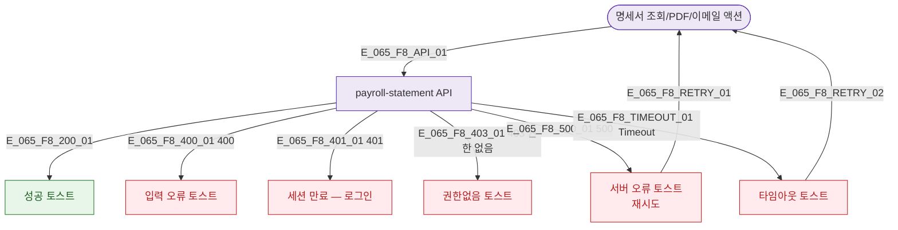

## 3. 다이어그램

## 5. TC 후보

| TC ID | 타입 | Given | When | Then |
|-------|------|-------|------|------|
| TC-065-F8-01 | exception | 명세서 조회 | API 500 | 서버 오류 토스트 + 재시도 |
| TC-065-F8-02 | negative | manager | PDF 생성 시도 | 정상 허용 |
| TC-065-F8-03 | exception | 명세서 조회 | 세션 만료 | 로그인 화면 |
