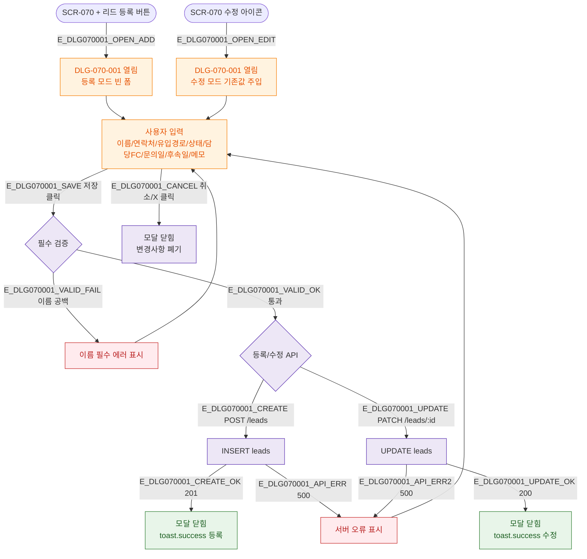

## 1. 목적

DLG-070-001 리드 등록/수정 모달의 트리거→열림→입력→검증→저장/취소→닫힘 생명주기를 TC 원천으로 제공한다.

## 3. 다이어그램

## 5. TC 후보

| TC ID | 타입 | Given | When | Then |
|-------|------|-------|------|------|
| TC-070-002 | positive P0 | 이름+유입경로 입력 | 저장 | toast.success("리드가 등록되었습니다.") |
| TC-070-003 | negative P0 | 이름 빈값 | 저장 | 이름 필수 에러 + 모달 유지 |
| TC-070-004 | positive P1 | 수정 모드 | 내용 변경→저장 | toast.success("리드가 수정되었습니다.") |
