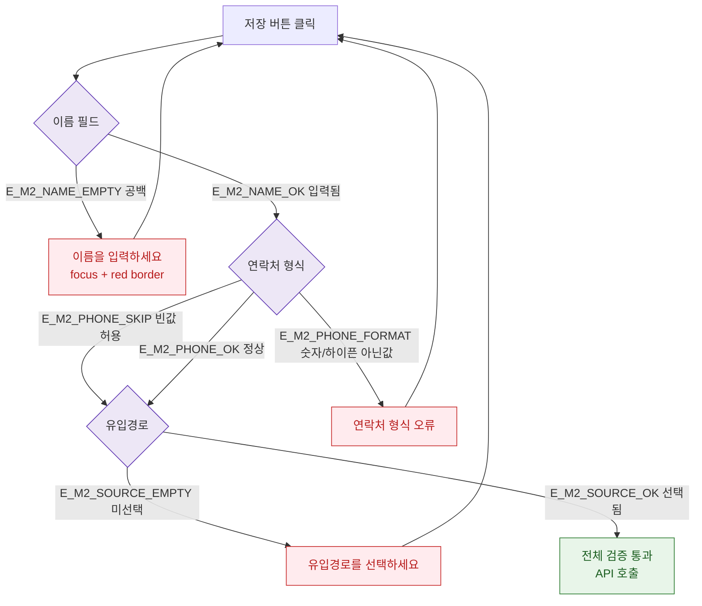

## 3. 다이어그램

## 5. TC 후보

| TC ID | 타입 | Given | When | Then |
|-------|------|-------|------|------|
| TC-070-003 | negative P0 | 이름 비움 | 저장 | 이름 필수 에러 |
| TC-070-M2-01 | negative P1 | 연락처 잘못된 형식 | 저장 | 연락처 형식 오류 |
