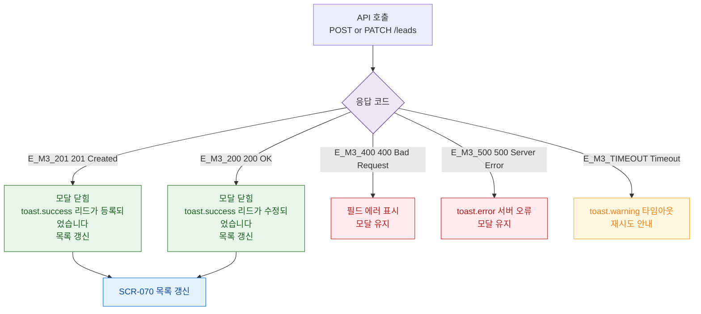

## 3. 다이어그램

## 5. TC 후보

| TC ID | 타입 | Given | When | Then |
|-------|------|-------|------|------|
| TC-070-002 | positive P0 | 정상 입력 | POST | 201 → toast.success + 목록 갱신 |
| TC-070-004 | positive P1 | 수정 | PATCH | 200 → toast.success + 목록 갱신 |
| TC-070-M3-01 | exception P2 | 서버 오류 | API | 500 → toast.error + 모달 유지 |
