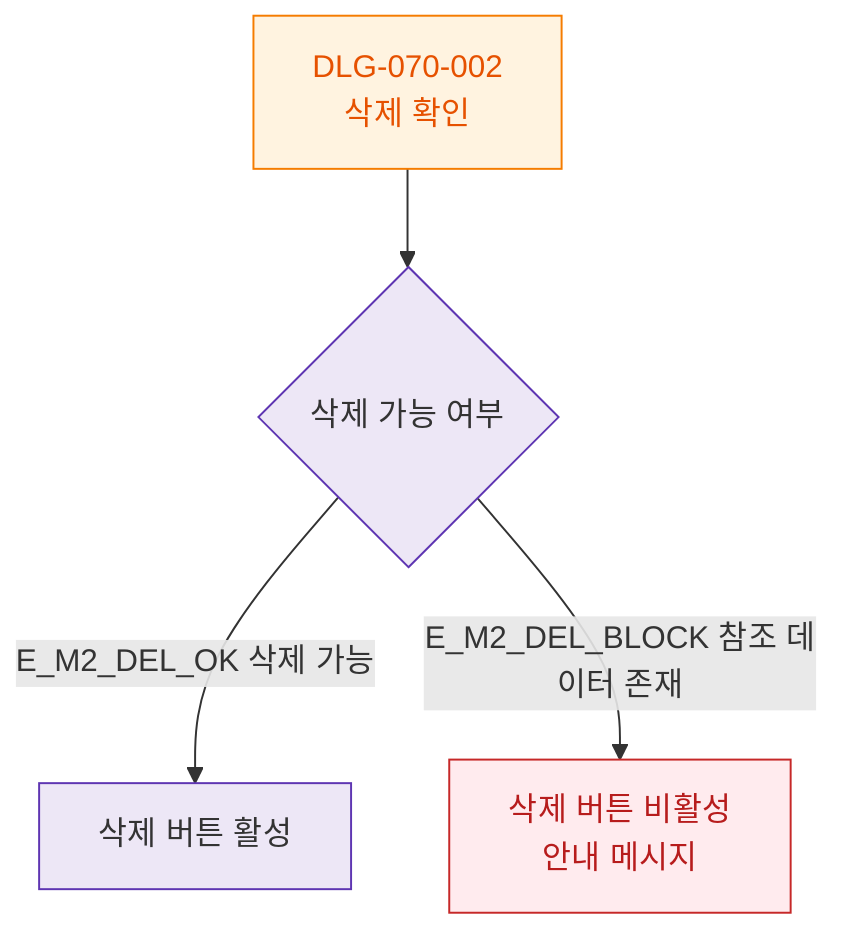

## 3. 다이어그램

```mermaid
flowchart TD
  MODAL[DLG-070-002\n삭제 확인] --> CHECK{삭제 가능 여부}
  CHECK -->|E_M2_DEL_OK 삭제 가능| BTN_ACTIVE[삭제 버튼 활성]
  CHECK -->|E_M2_DEL_BLOCK 참조 데이터 존재| BTN_DISABLED[삭제 버튼 비활성\n안내 메시지]

  classDef modal       fill:#FFF3E0,stroke:#F57C00,color:#E65100
  classDef error       fill:#FFEBEE,stroke:#C62828,color:#B71C1C
  classDef system      fill:#EDE7F6,stroke:#5E35B2

  class MODAL modal
  class BTN_DISABLED error
  class CHECK,BTN_ACTIVE system
```

## 5. TC 후보

| TC ID | 타입 | Given | When | Then |
|-------|------|-------|------|------|
| TC-070-M2-002-01 | positive P1 | 삭제 가능 리드 | 모달 열림 | 삭제 버튼 활성 |
