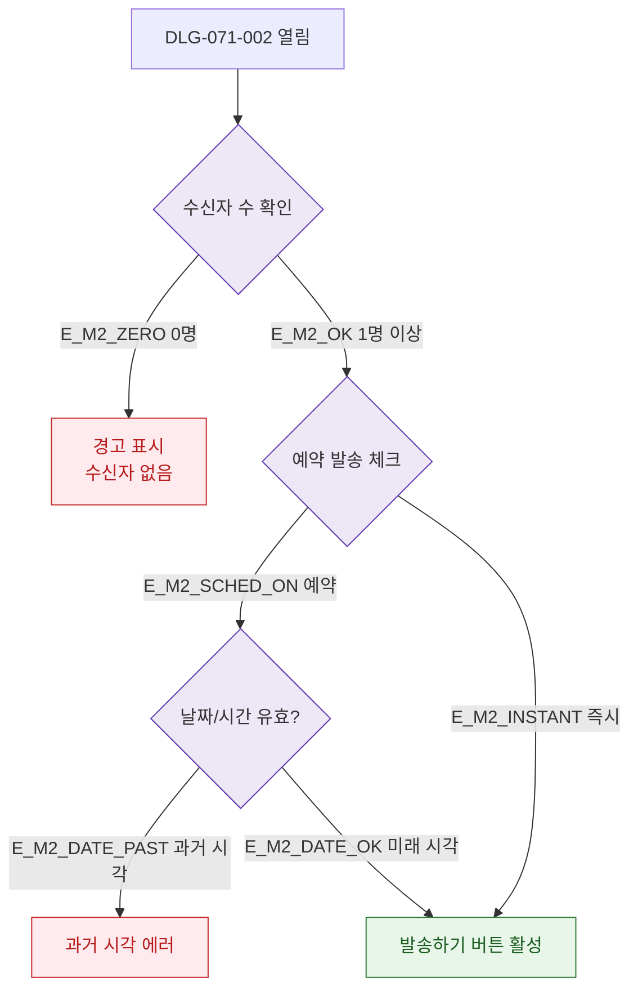

## 3. 다이어그램

```mermaid
flowchart TD
  OPEN[DLG-071-002 열림] --> CHECK_RECV{수신자 수 확인}
  CHECK_RECV -->|E_M2_ZERO 0명| WARN[경고 표시\n수신자 없음]
  CHECK_RECV -->|E_M2_OK 1명 이상| CHECK_SCHED{예약 발송 체크}
  CHECK_SCHED -->|E_M2_SCHED_ON 예약| CHECK_DATE{날짜/시간 유효?}
  CHECK_SCHED -->|E_M2_INSTANT 즉시| BTN_ACTIVE[발송하기 버튼 활성]
  CHECK_DATE -->|E_M2_DATE_PAST 과거 시각| ERR_DATE[과거 시각 에러]
  CHECK_DATE -->|E_M2_DATE_OK 미래 시각| BTN_ACTIVE

  classDef error       fill:#FFEBEE,stroke:#C62828,color:#B71C1C
  classDef success     fill:#E8F5E9,stroke:#2E7D32,color:#1B5E20
  classDef system      fill:#EDE7F6,stroke:#5E35B2
  classDef warning     fill:#FFF8E1,stroke:#F9A825,color:#F57F17

  class ERR_DATE,WARN error
  class BTN_ACTIVE success
  class CHECK_RECV,CHECK_SCHED,CHECK_DATE system
```

## 5. TC 후보

| TC ID | 타입 | Given | When | Then |
|-------|------|-------|------|------|
| TC-071-M2-002-01 | negative P1 | 예약 시각=과거 | 발송하기 | 과거 시각 에러 |
