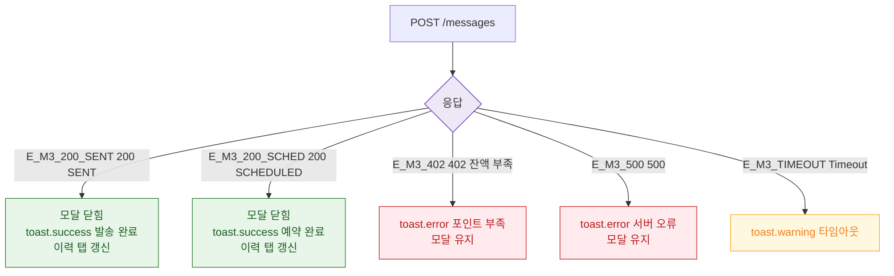

## 3. 다이어그램

## 5. TC 후보

| TC ID | 타입 | Given | When | Then |
|-------|------|-------|------|------|
| TC-071-001 | positive P0 | 즉시 발송 200 | POST | toast.success + 이력 갱신 |
| TC-071-009 | positive P1 | 예약 발송 200 | POST | toast.success 예약 완료 |
