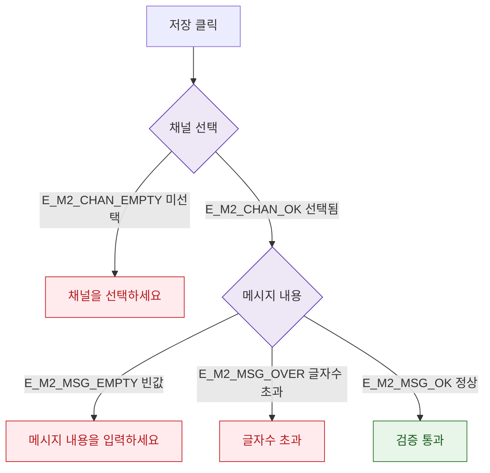

## 3. 다이어그램

```mermaid
flowchart TD
  SAVE[저장 클릭] --> F_CHAN{채널 선택}
  F_CHAN -->|E_M2_CHAN_EMPTY 미선택| ERR_CHAN[채널을 선택하세요]
  F_CHAN -->|E_M2_CHAN_OK 선택됨| F_MSG{메시지 내용}
  F_MSG -->|E_M2_MSG_EMPTY 빈값| ERR_MSG[메시지 내용을 입력하세요]
  F_MSG -->|E_M2_MSG_OVER 글자수 초과| ERR_OVER[글자수 초과]
  F_MSG -->|E_M2_MSG_OK 정상| ALL_OK[검증 통과]

  classDef error       fill:#FFEBEE,stroke:#C62828,color:#B71C1C
  classDef success     fill:#E8F5E9,stroke:#2E7D32,color:#1B5E20
  classDef system      fill:#EDE7F6,stroke:#5E35B2

  class ERR_CHAN,ERR_MSG,ERR_OVER error
  class ALL_OK success
  class F_CHAN,F_MSG system
```

## 5. TC 후보

| TC ID | 타입 | Given | When | Then |
|-------|------|-------|------|------|
| TC-072-M2-001-01 | negative P1 | 메시지 비움 | 저장 | 메시지 필수 에러 |
