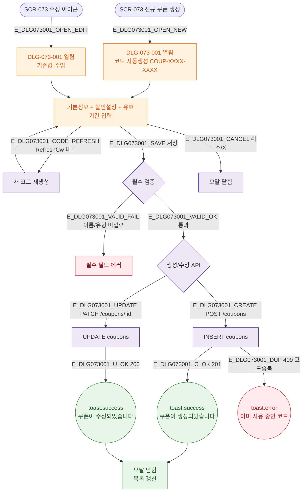

## 3. 다이어그램

## 5. TC 후보

| TC ID | 타입 | Given | When | Then |
|-------|------|-------|------|------|
| TC-073-001 | positive P0 | 이름+유형 입력 | 저장 | DB insert + 목록 갱신 |
| TC-073-002 | positive P1 | 모달 오픈 | 자동 생성 | COUP-XXXX-XXXX 패턴 |
| TC-073-003 | positive P2 | RefreshCw 클릭 | 재생성 | 새 코드 생성 |
