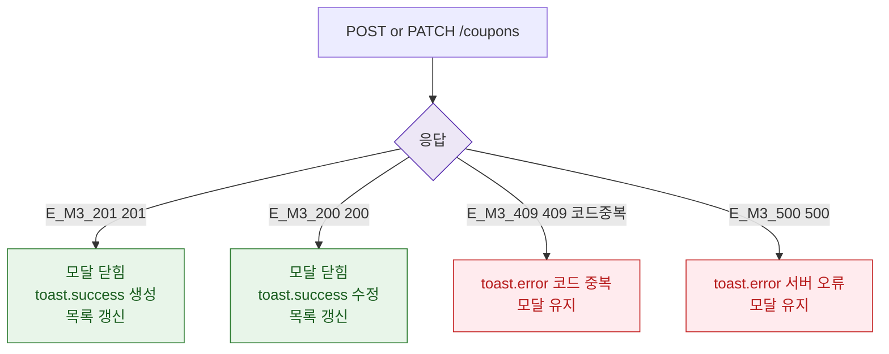

## 3. 다이어그램

## 5. TC 후보

| TC ID | 타입 | Given | When | Then |
|-------|------|-------|------|------|
| TC-073-001 | positive P0 | 정상 입력 | POST | 201 → toast + 목록 갱신 |
| TC-073-M3-001-01 | negative P1 | 코드 중복 | POST | 409 → toast.error |
