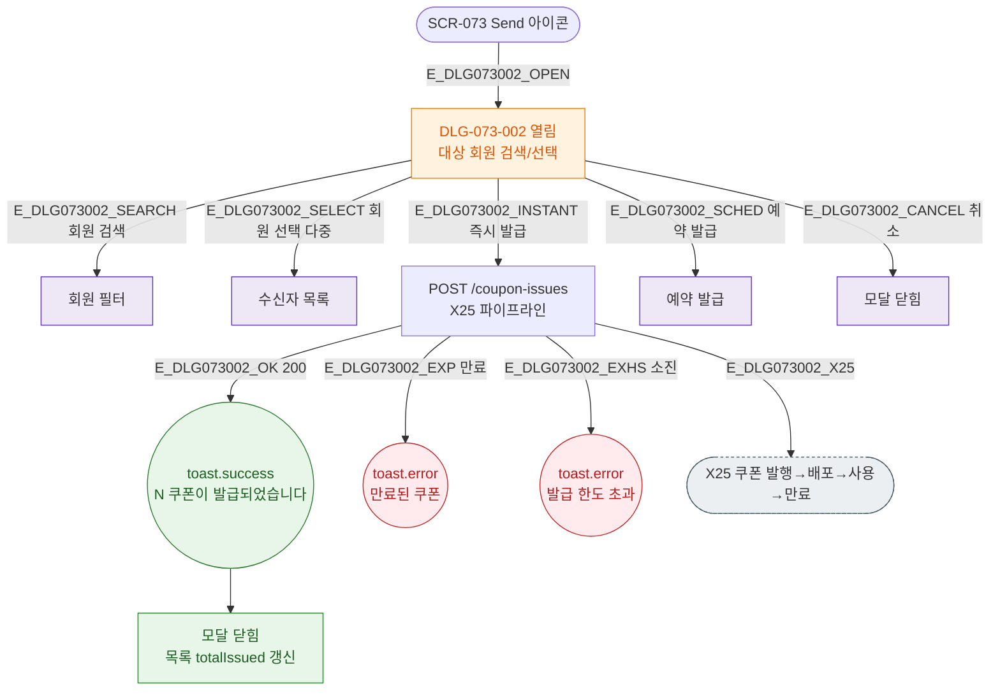

## 3. 다이어그램

## 5. TC 후보

| TC ID | 타입 | Given | When | Then |
|-------|------|-------|------|------|
| TC-073-004 | positive P1 | Send → 회원 선택 | 발급 | toast.success("N 쿠폰이 발급되었습니다.") |
| TC-073-M1-002-01 | negative P1 | 만료 쿠폰 발급 | 발급 | toast.error("만료된 쿠폰입니다.") |
