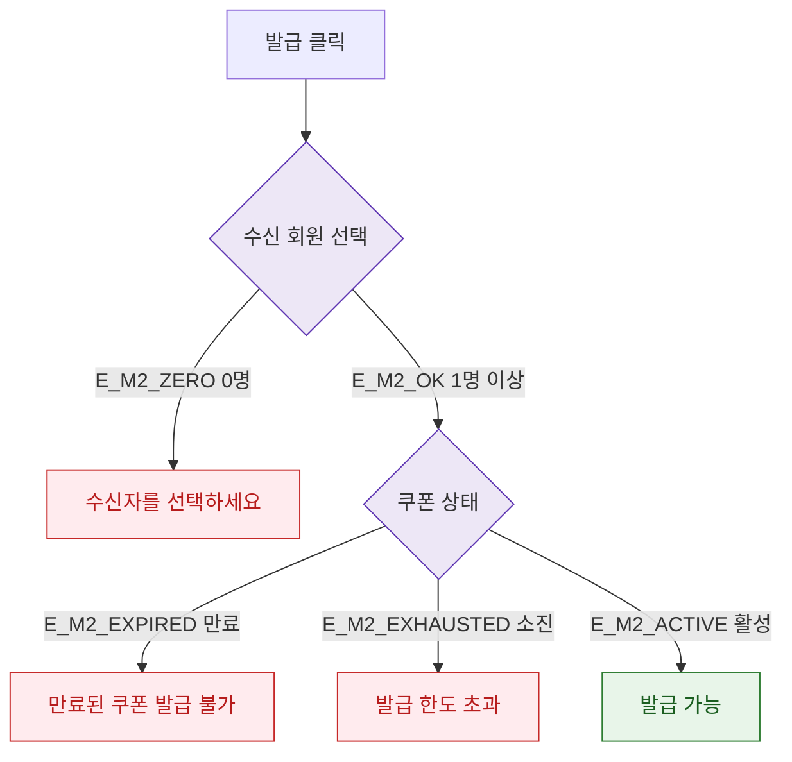

## 3. 다이어그램

```mermaid
flowchart TD
  ISSUE[발급 클릭] --> F_RECV{수신 회원 선택}
  F_RECV -->|E_M2_ZERO 0명| ERR_RECV[수신자를 선택하세요]
  F_RECV -->|E_M2_OK 1명 이상| F_STATUS{쿠폰 상태}
  F_STATUS -->|E_M2_EXPIRED 만료| ERR_EXP[만료된 쿠폰 발급 불가]
  F_STATUS -->|E_M2_EXHAUSTED 소진| ERR_EXHS[발급 한도 초과]
  F_STATUS -->|E_M2_ACTIVE 활성| ALL_OK[발급 가능]

  classDef error       fill:#FFEBEE,stroke:#C62828,color:#B71C1C
  classDef success     fill:#E8F5E9,stroke:#2E7D32,color:#1B5E20
  classDef system      fill:#EDE7F6,stroke:#5E35B2

  class ERR_RECV,ERR_EXP,ERR_EXHS error
  class ALL_OK success
  class F_RECV,F_STATUS system
```

## 5. TC 후보

| TC ID | 타입 | Given | When | Then |
|-------|------|-------|------|------|
| TC-073-M2-002-01 | negative P1 | 소진 쿠폰 | 발급 시도 | 발급 한도 초과 에러 |
