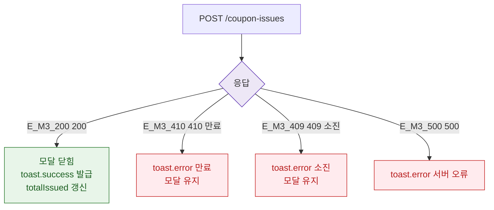

## 3. 다이어그램

```mermaid
flowchart TD
  API[POST /coupon-issues] --> RESP{응답}
  RESP -->|E_M3_200 200| OK[모달 닫힘\ntoast.success 발급\ntotalIssued 갱신]
  RESP -->|E_M3_410 410 만료| ERR_EXP[toast.error 만료\n모달 유지]
  RESP -->|E_M3_409 409 소진| ERR_EXHS[toast.error 소진\n모달 유지]
  RESP -->|E_M3_500 500| ERR_SRV[toast.error 서버 오류]

  classDef success     fill:#E8F5E9,stroke:#2E7D32,color:#1B5E20
  classDef error       fill:#FFEBEE,stroke:#C62828,color:#B71C1C
  classDef system      fill:#EDE7F6,stroke:#5E35B2

  class OK success
  class ERR_EXP,ERR_EXHS,ERR_SRV error
  class RESP system
```

## 5. TC 후보

| TC ID | 타입 | Given | When | Then |
|-------|------|-------|------|------|
| TC-073-004 | positive P1 | 활성 쿠폰 발급 | 200 | toast.success + totalIssued++ |
