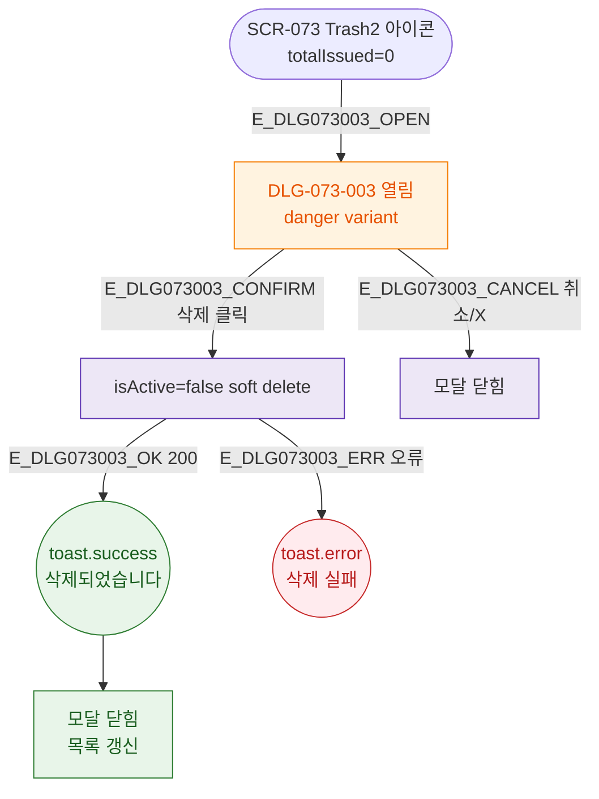

## 3. 다이어그램

```mermaid
flowchart TD
  TRIGGER([SCR-073 Trash2 아이콘\ntotalIssued=0]) -->|E_DLG073003_OPEN| MODAL[DLG-073-003 열림\ndanger variant]
  MODAL -->|E_DLG073003_CONFIRM 삭제 클릭| API[isActive=false soft delete]
  MODAL -->|E_DLG073003_CANCEL 취소/X| CLOSE[모달 닫힘]
  API -->|E_DLG073003_OK 200| T_OK((toast.success\n삭제되었습니다))
  API -->|E_DLG073003_ERR 오류| T_ERR((toast.error\n삭제 실패))
  T_OK --> CLOSE_OK[모달 닫힘\n목록 갱신]

  classDef modal       fill:#FFF3E0,stroke:#F57C00,color:#E65100
  classDef success     fill:#E8F5E9,stroke:#2E7D32,color:#1B5E20
  classDef error       fill:#FFEBEE,stroke:#C62828,color:#B71C1C
  classDef system      fill:#EDE7F6,stroke:#5E35B2

  class MODAL modal
  class T_OK,CLOSE_OK success
  class T_ERR error
  class API,CLOSE system
```

## 5. TC 후보

| TC ID | 타입 | Given | When | Then |
|-------|------|-------|------|------|
| TC-073-006 | positive P1 | totalIssued=0 | 삭제 확인 | isActive=false + toast.success |
