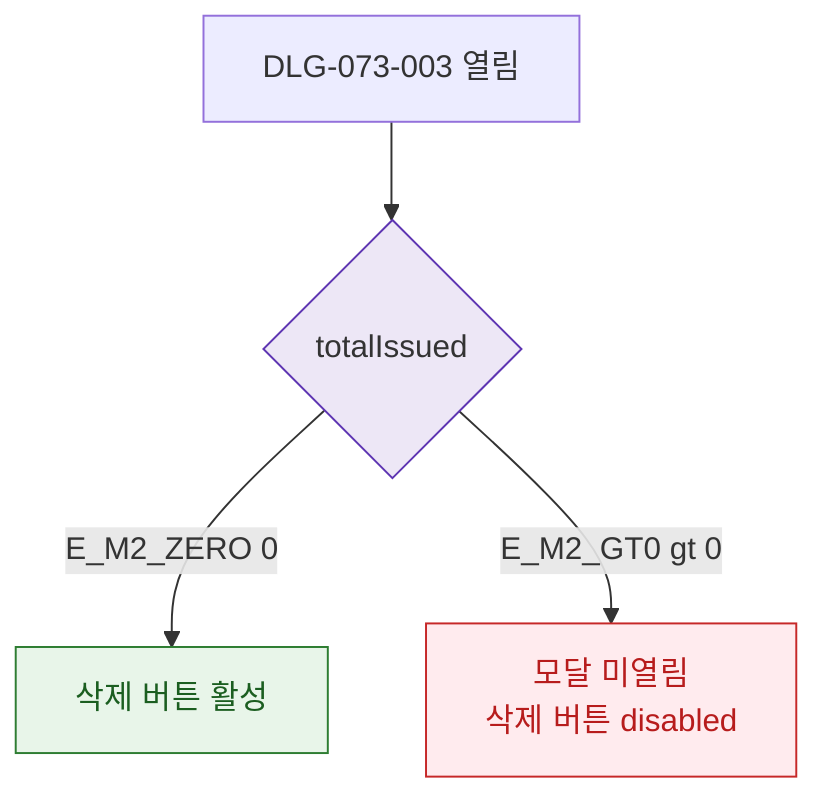

## 3. 다이어그램

```mermaid
flowchart TD
  OPEN[DLG-073-003 열림] --> CHECK{totalIssued}
  CHECK -->|E_M2_ZERO 0| BTN_ACTIVE[삭제 버튼 활성]
  CHECK -->|E_M2_GT0 gt 0| BLOCKED[모달 미열림\n삭제 버튼 disabled]

  classDef error       fill:#FFEBEE,stroke:#C62828,color:#B71C1C
  classDef success     fill:#E8F5E9,stroke:#2E7D32,color:#1B5E20
  classDef system      fill:#EDE7F6,stroke:#5E35B2

  class BLOCKED error
  class BTN_ACTIVE success
  class CHECK system
```

## 5. TC 후보

| TC ID | 타입 | Given | When | Then |
|-------|------|-------|------|------|
| TC-073-005 | negative P1 | totalIssued>0 | 삭제 클릭 | 버튼 disabled, 모달 미열림 |
