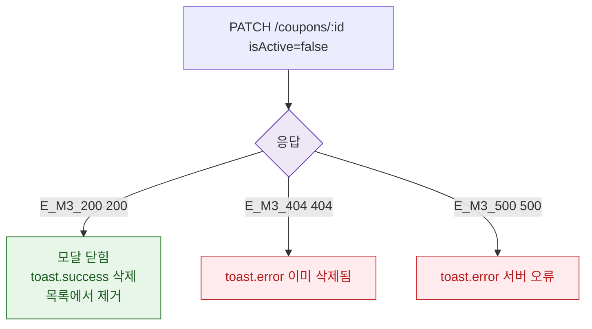

## 3. 다이어그램

```mermaid
flowchart TD
  API[PATCH /coupons/:id isActive=false] --> RESP{응답}
  RESP -->|E_M3_200 200| OK[모달 닫힘\ntoast.success 삭제\n목록에서 제거]
  RESP -->|E_M3_404 404| ERR_404[toast.error 이미 삭제됨]
  RESP -->|E_M3_500 500| ERR_SRV[toast.error 서버 오류]

  classDef success     fill:#E8F5E9,stroke:#2E7D32,color:#1B5E20
  classDef error       fill:#FFEBEE,stroke:#C62828,color:#B71C1C
  classDef system      fill:#EDE7F6,stroke:#5E35B2

  class OK success
  class ERR_404,ERR_SRV error
  class RESP system
```

## 5. TC 후보

| TC ID | 타입 | Given | When | Then |
|-------|------|-------|------|------|
| TC-073-006 | positive P1 | 삭제 확인 | 200 | isActive=false + 목록 제거 |
