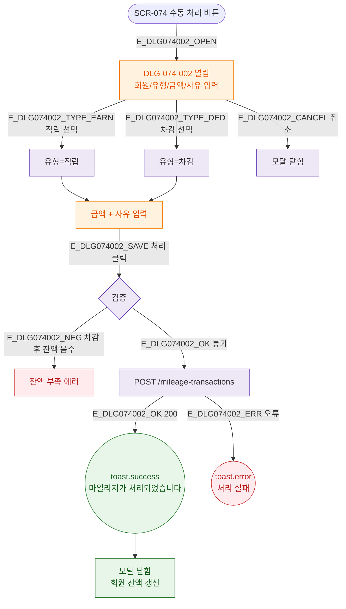

## 3. 다이어그램

## 5. TC 후보

| TC ID | 타입 | Given | When | Then |
|-------|------|-------|------|------|
| TC-074-F2-02 | positive P1 | 수동 처리 | 처리 완료 | toast.success("마일리지가 처리되었습니다.") |
| TC-074-M1-002-01 | negative P1 | 잔액 부족 | 차감 시도 | 잔액 부족 에러 |
