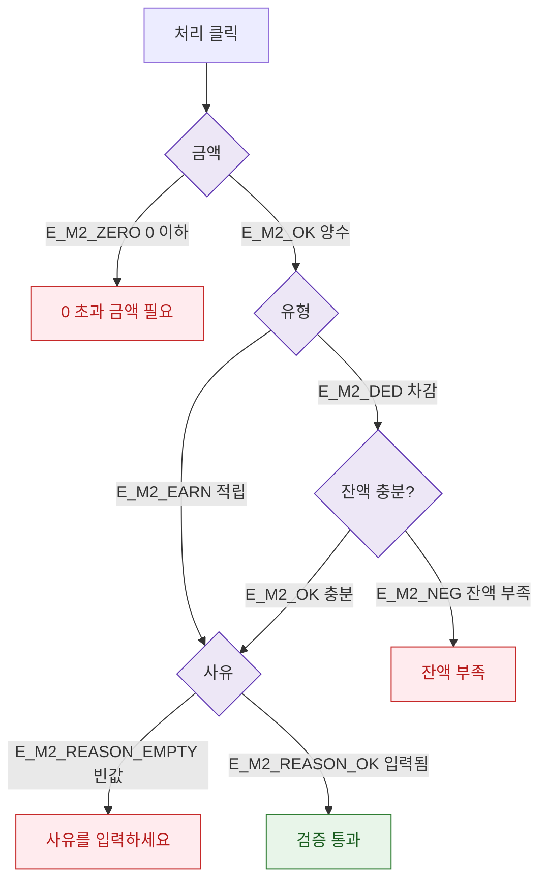

## 3. 다이어그램

## 5. TC 후보

| TC ID | 타입 | Given | When | Then |
|-------|------|-------|------|------|
| TC-074-M2-002-01 | negative P1 | 차감 금액 > 잔액 | 처리 | 잔액 부족 에러 |
| TC-074-M2-002-02 | negative P1 | 사유 비움 | 처리 | 사유 필수 에러 |
