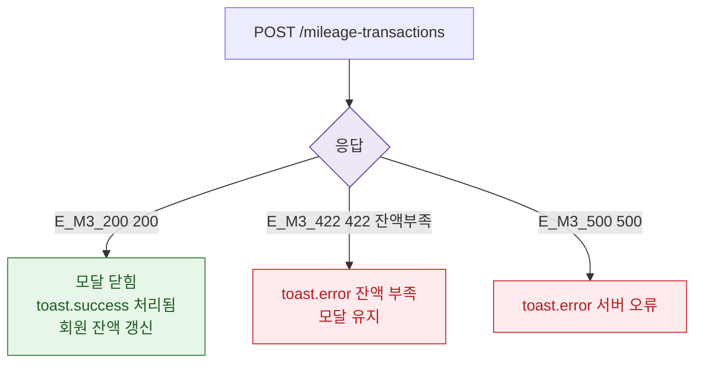

## 3. 다이어그램

## 5. TC 후보

| TC ID | 타입 | Given | When | Then |
|-------|------|-------|------|------|
| TC-074-F2-02 | positive P1 | 정상 처리 | 200 | toast.success + 잔액 갱신 |
| TC-074-M3-002-01 | negative P1 | 잔액 부족 | 422 | toast.error 잔액 부족 |
