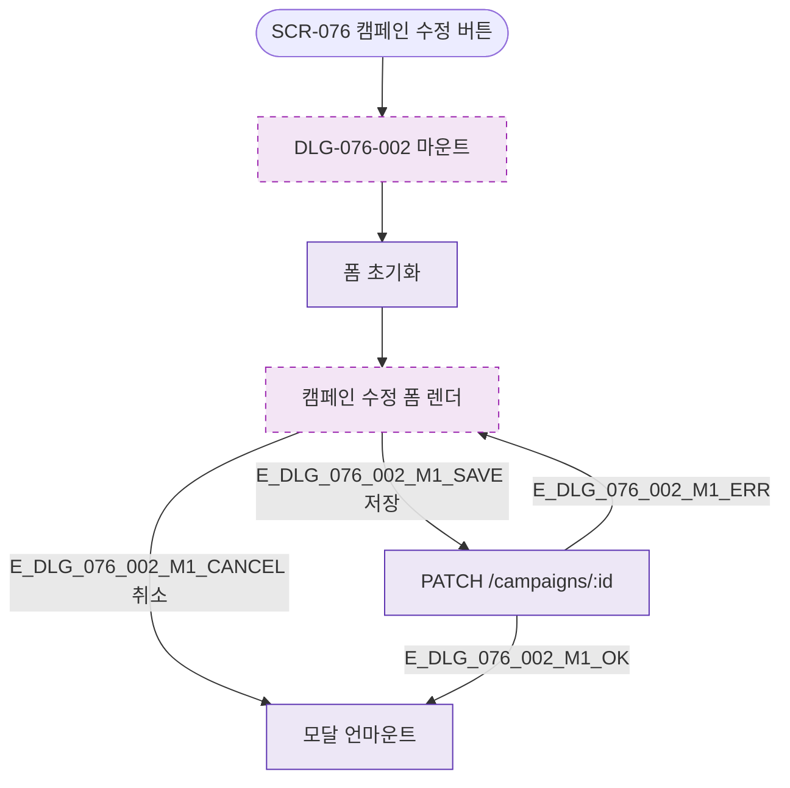

## 3. 다이어그램

```mermaid
flowchart TD
  TRIGGER([SCR-076 캠페인 수정 버튼]) --> OPEN[DLG-076-002 마운트]
  OPEN --> INIT[폼 초기화]
  INIT --> RENDER[캠페인 수정 폼 렌더]
  RENDER -->|E_DLG_076_002_M1_SAVE 저장| SUBMIT[PATCH /campaigns/:id]
  RENDER -->|E_DLG_076_002_M1_CANCEL 취소| UNMOUNT[모달 언마운트]
  SUBMIT -->|E_DLG_076_002_M1_OK| UNMOUNT
  SUBMIT -->|E_DLG_076_002_M1_ERR| RENDER

  classDef newFeature fill:#F3E5F5,stroke:#9C27B0,stroke-dasharray:5 5
  classDef system     fill:#EDE7F6,stroke:#5E35B2

  class OPEN,RENDER newFeature
  class INIT,SUBMIT,UNMOUNT system
```

## 5. TC 후보

| TC ID | 타입 | Given | When | Then |
|-------|------|-------|------|------|
| TC-DLG-076-002-M1-01 | positive P0 | 캠페인 수정 버튼 | 클릭 | DLG-076-002 열림 |
