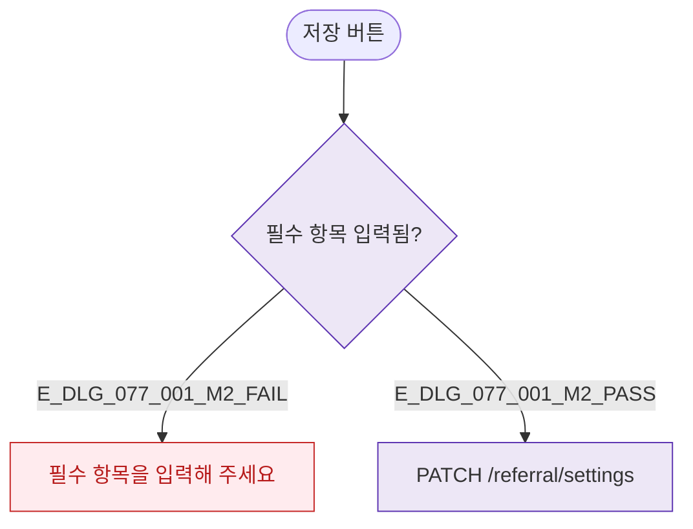

## 3. 다이어그램

```mermaid
flowchart TD
  SUBMIT([저장 버튼]) --> V_REQ{필수 항목 입력됨?}
  V_REQ -->|E_DLG_077_001_M2_FAIL| ERR[필수 항목을 입력해 주세요]
  V_REQ -->|E_DLG_077_001_M2_PASS| API[PATCH /referral/settings]

  classDef error  fill:#FFEBEE,stroke:#C62828,color:#B71C1C
  classDef system fill:#EDE7F6,stroke:#5E35B2

  class ERR error
  class V_REQ,API system
```

## 5. TC 후보

| TC ID | 타입 | Given | When | Then |
|-------|------|-------|------|------|
| TC-DLG-077-001-M2-01 | negative P0 | 필수 항목 미입력 | 저장 | 필수 항목 에러 |
