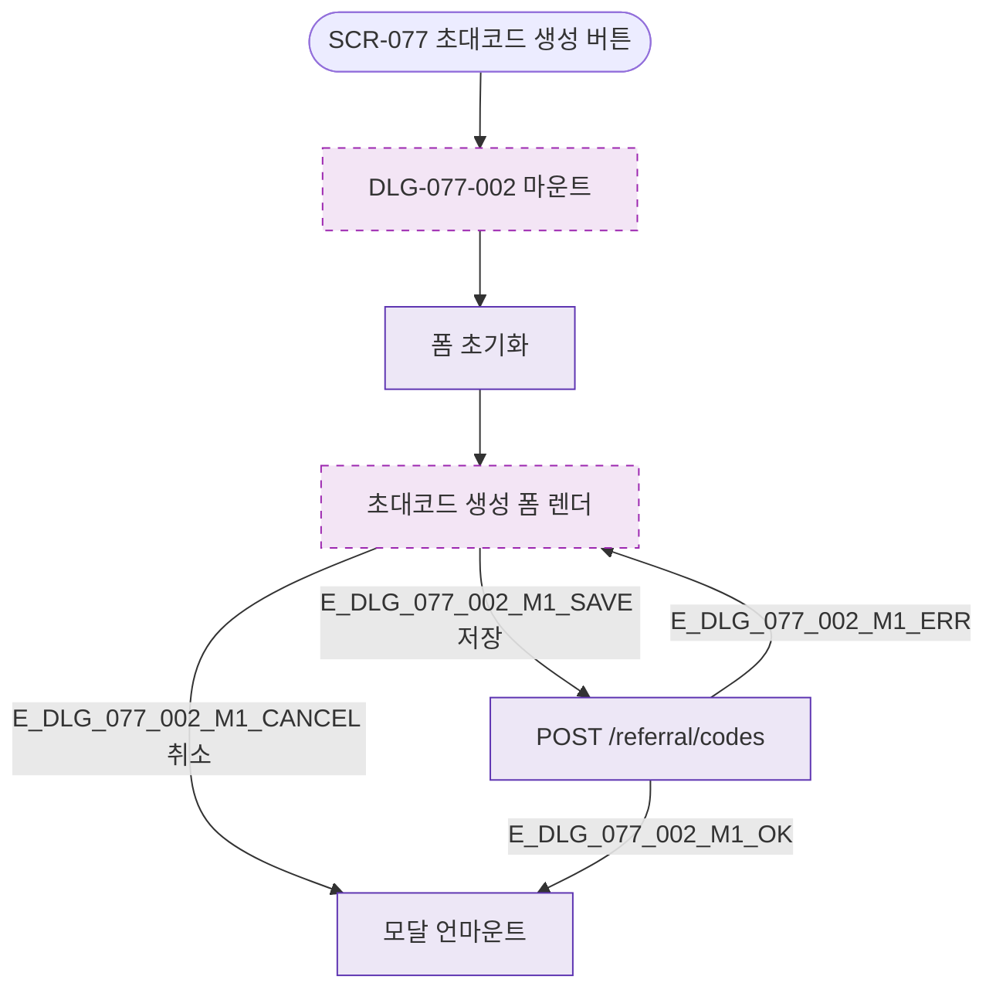

## 3. 다이어그램

```mermaid
flowchart TD
  TRIGGER([SCR-077 초대코드 생성 버튼]) --> OPEN[DLG-077-002 마운트]
  OPEN --> INIT[폼 초기화]
  INIT --> RENDER[초대코드 생성 폼 렌더]
  RENDER -->|E_DLG_077_002_M1_SAVE 저장| SUBMIT[POST /referral/codes]
  RENDER -->|E_DLG_077_002_M1_CANCEL 취소| UNMOUNT[모달 언마운트]
  SUBMIT -->|E_DLG_077_002_M1_OK| UNMOUNT
  SUBMIT -->|E_DLG_077_002_M1_ERR| RENDER

  classDef newFeature fill:#F3E5F5,stroke:#9C27B0,stroke-dasharray:5 5
  classDef system     fill:#EDE7F6,stroke:#5E35B2

  class OPEN,RENDER newFeature
  class INIT,SUBMIT,UNMOUNT system
```

## 5. TC 후보

| TC ID | 타입 | Given | When | Then |
|-------|------|-------|------|------|
| TC-DLG-077-002-M1-01 | positive P0 | 초대코드 생성 버튼 | 클릭 | DLG-077-002 열림 |
