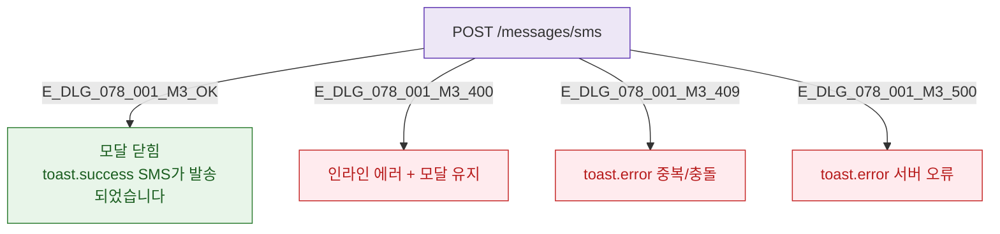

## 3. 다이어그램

```mermaid
flowchart TD
  API[POST /messages/sms] -->|E_DLG_078_001_M3_OK| SUCCESS[모달 닫힘\ntoast.success SMS가 발송되었습니다]
  API -->|E_DLG_078_001_M3_400| ERR_400[인라인 에러 + 모달 유지]
  API -->|E_DLG_078_001_M3_409| ERR_409[toast.error 중복/충돌]
  API -->|E_DLG_078_001_M3_500| ERR_500[toast.error 서버 오류]

  classDef success fill:#E8F5E9,stroke:#2E7D32,color:#1B5E20
  classDef error   fill:#FFEBEE,stroke:#C62828,color:#B71C1C
  classDef system  fill:#EDE7F6,stroke:#5E35B2

  class SUCCESS success
  class ERR_400,ERR_409,ERR_500 error
  class API system
```

## 5. TC 후보

| TC ID | 타입 | Given | When | Then |
|-------|------|-------|------|------|
| TC-DLG-078-001-M3-01 | positive P0 | 유효 입력 | 저장 | 모달 닫힘 + toast.success("SMS가 발송되었습니다") |
