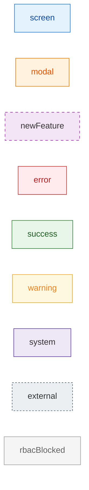

# D08 마케팅 도메인 다이어그램

## 개요

마케팅 도메인은 리드 파이프라인 관리, 메시지 발송, 자동 알림, 쿠폰/마일리지, 전자계약, 캠페인, 리퍼럴, SMS/카카오 발송 연동, A/B 테스트 기능을 포함합니다.

## 화면 목록

| SCR | 이름 | 경로 | 상태 | |-----|------|------|------| | SCR-070 | 리드 관리 | / | 구현됨 | | SCR-071 | 메시지 발송 | /message | 구현됨 | | SCR-072 | 자동 알림 설정 | | 구현됨 | | SCR-073 | 쿠폰 관리 | | 구현됨 | | SCR-074 | 마일리지 관리 | /mileage | 구현됨 | | SCR-075 | 전자계약 (5단계 위자드) | | 구현됨 | | SCR-076 | 🆕 캠페인 관리 | | 미구현 | | SCR-077 | 🆕 리퍼럴 프로그램 | | 미구현 | | SCR-078 | 🆕 SMS/카카오 실제 발송 | | 미구현 | | SCR-079 | 🆕 A/B 테스트 | | 미구현 |

## 다이얼로그 목록

| DLG | 이름 | 연결 SCR | variant | |-----|------|---------|---------| | DLG-070-001 | 리드 등록/수정 | SCR-070 | primary | | DLG-070-002 | 리드 삭제 확인 | SCR-070 | danger | | DLG-071-001 | 수신자 검색 | SCR-071 | - | | DLG-071-002 | 발송 미리보기 | SCR-071 | primary | | DLG-072-001 | 알림 규칙 편집 | SCR-072 | primary | | DLG-073-001 | 쿠폰 생성/수정 | SCR-073 | primary | | DLG-073-002 | 쿠폰 발급 | SCR-073 | primary | | DLG-073-003 | 쿠폰 삭제 확인 | SCR-073 | danger | | DLG-074-001 | 적립 규칙 편집 | SCR-074 | primary | | DLG-074-002 | 수동 적립/차감 | SCR-074 | primary | | DLG-076-001 | 🆕 캠페인 생성 위자드 | SCR-076 | primary | | DLG-076-002 | 🆕 캠페인 분석 상세 | SCR-076 | - | | DLG-077-001 | 🆕 리퍼럴 보상 설정 | SCR-077 | primary | | DLG-077-002 | 🆕 추천 코드 생성 | SCR-077 | primary | | DLG-078-001 | 🆕 발송 설정 | SCR-078 | primary | | DLG-078-002 | 🆕 발신번호 등록 | SCR-078 | primary | | DLG-079-001 | 🆕 A/B 테스트 생성 | SCR-079 | primary | | DLG-079-002 | 🆕 테스트 결과 분석 | SCR-079 | - |

## 도메인 특이사항

- **리드 파이프라인**: 7종 상태(신규/연락완료/상담예정/방문완료/등록완료/미전환/보류) + 목록/칸반 뷰 전환
- **X08 시퀀스 연결**: 자동 알림(SCR-072) 13종 규칙이 메시지 발송(SCR-071)과 연동
- **쿠폰 X25 시퀀스**: SCR-073 쿠폰 발급 → member_coupons 테이블 → 결제 시 자동 차감
- **🆕 미구현**: SCR-076~079 (캠페인, 리퍼럴, SMS 연동, A/B 테스트) — newFeature classDef 적용
- **RBAC**: fc/코치 역할은 리드(SCR-070) 생성/수정 가능, 쿠폰/마일리지 관리는 owner/manager 한정

## classDef 통일 기준

