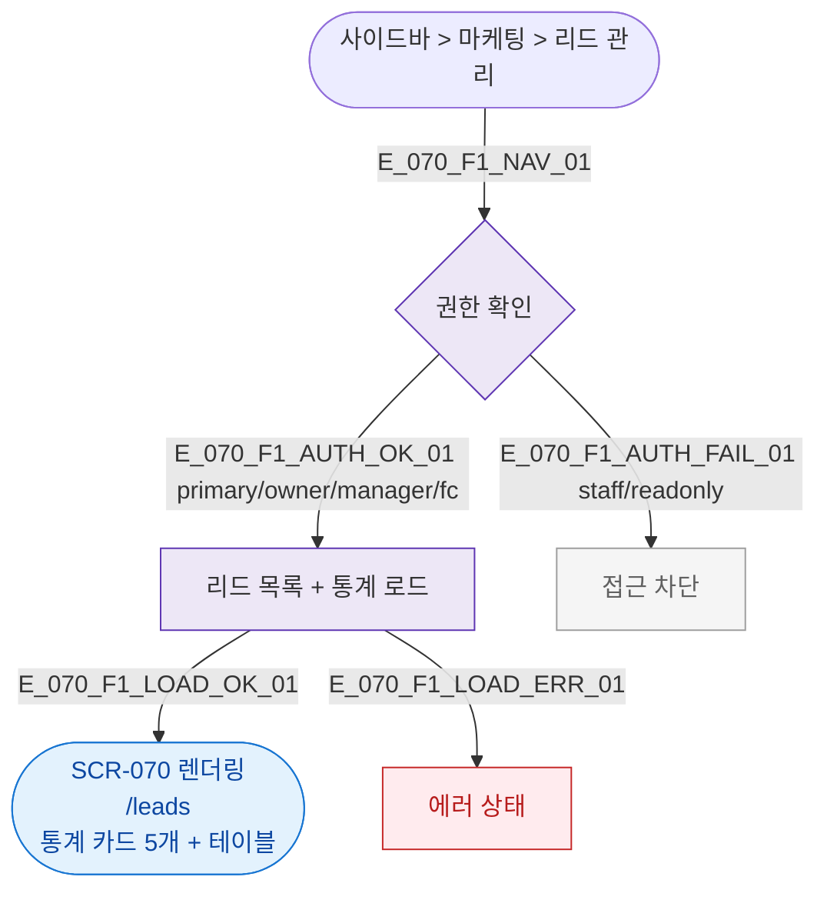

## 3. 다이어그램

## 5. TC 후보

| TC ID | 타입 | Given | When | Then |
|-------|------|-------|------|------|
| TC-070-F1-01 | positive | owner | /leads 진입 | 통계 카드 5개 + 테이블 렌더링 |
| TC-070-F1-02 | positive | fc | /leads 진입 | 정상 접근 허용 |
| TC-070-F1-03 | negative | staff | 접근 시도 | 접근 차단 |
