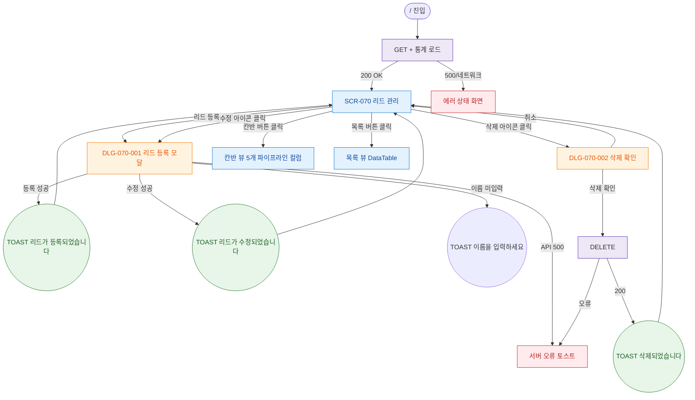

## 1. 목적

리드 관리 화면의 정상 Happy Path — 목록 조회, 리드 등록/수정/삭제, 뷰 전환 흐름을 TC 원천으로 제공한다.

## 2. 전제조건

- 로그인 상태 (primary)
- `/` 경로 진입

## 3. 다이어그램

## 4. 엣지 설명

| 출발 | 도착 | 조건/액션 | |---------|------|------|----------| | | LOAD_API | SCR_070 | 200 OK — 정상 렌더 | | | LOAD_API | ERR_LOAD | 500/네트워크 실패 | | | SCR_070 | DLG_070_001 | + 리드 등록 버튼 | | | SCR_070 | DLG_070_001 | 수정 아이콘 (기존 데이터 주입) | | | SCR_070 | DLG_070_002 | 삭제 아이콘 | | | DLG_070_001 | TOAST_OK | 등록 성공 | | | DLG_070_001 | TOAST_EDIT | 수정 성공 | | | DLG_070_001 | TOAST_ERR | 이름 필드 비어있음 | | | DLG_070_002 | DEL_API | 삭제 확인 클릭 | | | SCR_070 | KANBAN | 칸반 버튼 토글 | | | SCR_070 | LIST | 목록 버튼 토글 |
