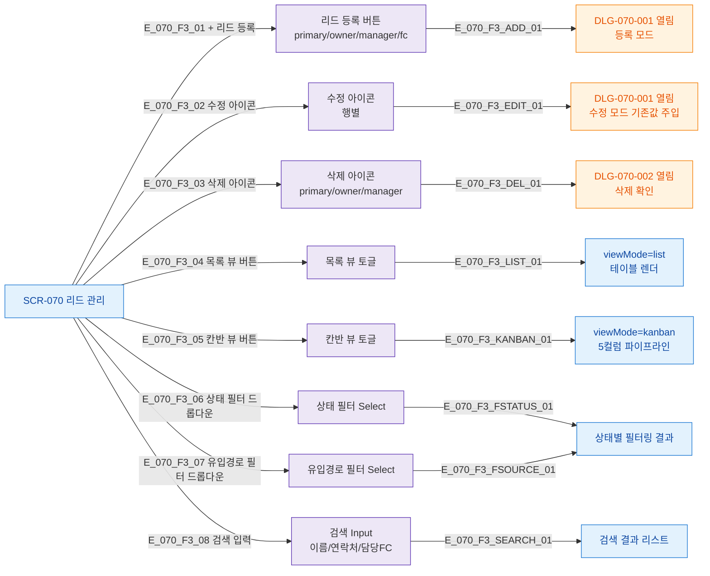

## 1. 목적

SCR-070 화면 내 모든 버튼/액션 노드를 망라하여 버튼별 동작 TC 원천을 제공한다.

## 2. 전제조건

- SCR-070 렌더링 완료 상태

## 3. 다이어그램

## 4. 엣지 설명

| 엣지 ID | 버튼 | 동작 |
|---------|------|------|
| E_070_F3_01 | + 리드 등록 | DLG-070-001 등록 모드 열기 |
| E_070_F3_02 | 수정 아이콘 | DLG-070-001 수정 모드 (기존값) |
| E_070_F3_03 | 삭제 아이콘 | DLG-070-002 삭제 확인 |
| E_070_F3_04 | 목록 뷰 버튼 | viewMode=list |
| E_070_F3_05 | 칸반 뷰 버튼 | viewMode=kanban |
| E_070_F3_06 | 상태 필터 | filterStatus 변경 |
| E_070_F3_07 | 유입경로 필터 | filterSource 변경 |
| E_070_F3_08 | 검색 입력 | searchValue 변경 |

## 5. TC 후보

| TC ID | 타입 | Given | When | Then |
|-------|------|-------|------|------|
| TC-070-F3-01 | positive P0 | SCR-070 렌더 | + 리드 등록 클릭 | DLG-070-001 열림 |
| TC-070-F3-02 | positive P1 | 기존 리드 행 | 수정 아이콘 클릭 | DLG-070-001 기존값 주입 |
| TC-070-F3-03 | positive P1 | 기존 리드 행 | 삭제 아이콘 클릭 | DLG-070-002 열림 |
| TC-070-F3-04 | positive P1 | 목록 뷰 상태 | 칸반 버튼 클릭 | 5컬럼 칸반 뷰 전환 |
