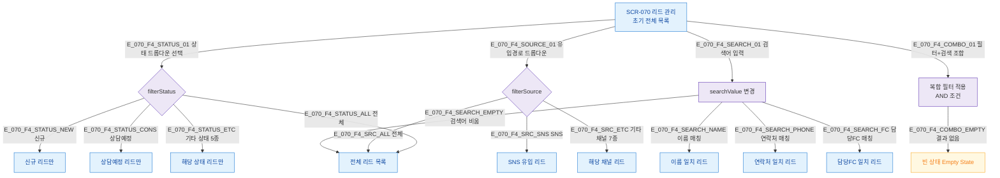

## 1. 목적

상태/유입경로 필터, 텍스트 검색, 뷰 전환 조합 쿼리 흐름을 TC 원천으로 제공한다.

## 2. 전제조건

- SCR-070 렌더링 완료, 리드 데이터 1건 이상 존재

## 3. 다이어그램

## 4. 엣지 설명

| 엣지 ID | 필터 | 결과 |
|---------|------|------|
| E_070_F4_STATUS_01 | 상태 드롭다운 | filterStatus 값 변경 |
| E_070_F4_SOURCE_01 | 유입경로 드롭다운 | filterSource 값 변경 |
| E_070_F4_SEARCH_01 | 검색 input | searchValue 실시간 변경 |
| E_070_F4_COMBO_01 | 필터+검색 동시 | AND 조건 복합 필터 |
| E_070_F4_COMBO_EMPTY | 결과 없음 | Empty State UI |

## 5. TC 후보

| TC ID | 타입 | Given | When | Then |
|-------|------|-------|------|------|
| TC-070-006 | positive P1 | 리드 데이터 존재 | 상태=신규 선택 | 신규 리드만 표시 |
| TC-070-007 | positive P1 | 리드 데이터 존재 | 유입경로=SNS 선택 | SNS 유입 리드만 표시 |
| TC-070-008 | positive P1 | 리드 데이터 존재 | 이름 "홍길동" 입력 | 이름 매칭 리드만 표시 |
| TC-070-009 | positive P1 | 리드 데이터 존재 | "010-1234" 입력 | 연락처 매칭 리드만 표시 |
| TC-070-F4-01 | edge P2 | 필터+검색 조합 | 결과 없음 | Empty State UI 표시 |
