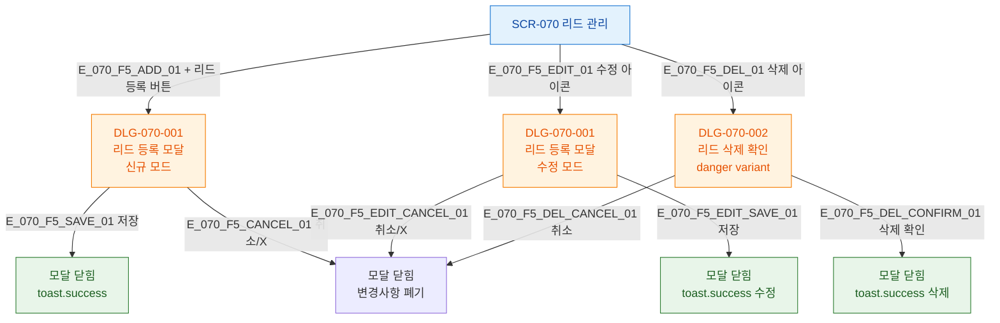

## 1. 목적

SCR-070에서 발생 가능한 모든 모달 트리거 경로를 트리 형태로 표현한다.

## 2. 전제조건

- SCR-070 렌더링 완료

## 3. 다이어그램

## 4. 엣지 설명

| 엣지 ID | 트리거 | 모달 | 모드 |
|---------|--------|------|------|
| E_070_F5_ADD_01 | + 리드 등록 버튼 | DLG-070-001 | 신규 |
| E_070_F5_EDIT_01 | 수정 아이콘 | DLG-070-001 | 수정 |
| E_070_F5_DEL_01 | 삭제 아이콘 | DLG-070-002 | danger |
| E_070_F5_SAVE_01 | 저장 | 모달 닫힘 | 성공 toast |
| E_070_F5_CANCEL_01 | 취소/X | 모달 닫힘 | 폐기 |

## 5. TC 후보

| TC ID | 타입 | Given | When | Then |
|-------|------|-------|------|------|
| TC-070-F5-01 | positive P0 | SCR-070 | + 리드 등록 클릭 | DLG-070-001 신규 모드 열림 |
| TC-070-F5-02 | positive P1 | 기존 리드 | 수정 클릭 | DLG-070-001 수정 모드 기존값 |
| TC-070-F5-03 | positive P1 | 기존 리드 | 삭제 클릭 | DLG-070-002 열림 |
| TC-070-F5-04 | positive P1 | 모달 열림 | 취소 클릭 | 모달 닫힘, 데이터 유지 |
