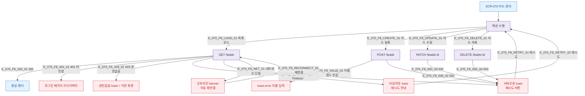

## 1. 목적

SCR-070에서 발생 가능한 에러/예외 케이스와 복구 경로를 네거티브 TC 원천으로 제공한다.

## 2. 전제조건

- SCR-070 접근 가능 역할 로그인

## 3. 다이어그램

## 4. 엣지 설명

| 엣지 ID | 에러 코드 | 처리 |
|---------|----------|------|
| E_070_F8_401_01 | 401 미인증 | 로그인 리다이렉트 |
| E_070_F8_403_01 | 403 권한없음 | toast + 이전 화면 |
| E_070_F8_500_01 | 500 서버오류 | 에러 toast + 재시도 |
| E_070_F8_TIMEOUT_01 | Timeout | 타임아웃 toast + 재시도 |
| E_070_F8_NET_01 | 네트워크 단절 | 오프라인 banner |
| E_070_F8_VALID_01 | 필드 검증 실패 | toast.error |

## 5. TC 후보

| TC ID | 타입 | Given | When | Then |
|-------|------|-------|------|------|
| TC-070-F8-01 | negative P0 | 미로그인 | /leads 접근 | 로그인 페이지 리다이렉트 |
| TC-070-F8-02 | exception P1 | API 500 응답 | 목록 로드 | 에러 toast + 재시도 버튼 |
| TC-070-F8-03 | exception P2 | 네트워크 단절 | 페이지 사용 중 | 오프라인 banner + 자동 재연결 |
| TC-070-F8-04 | negative P0 | 이름 빈값 | 저장 클릭 | toast.error("이름을 입력하세요.") |
