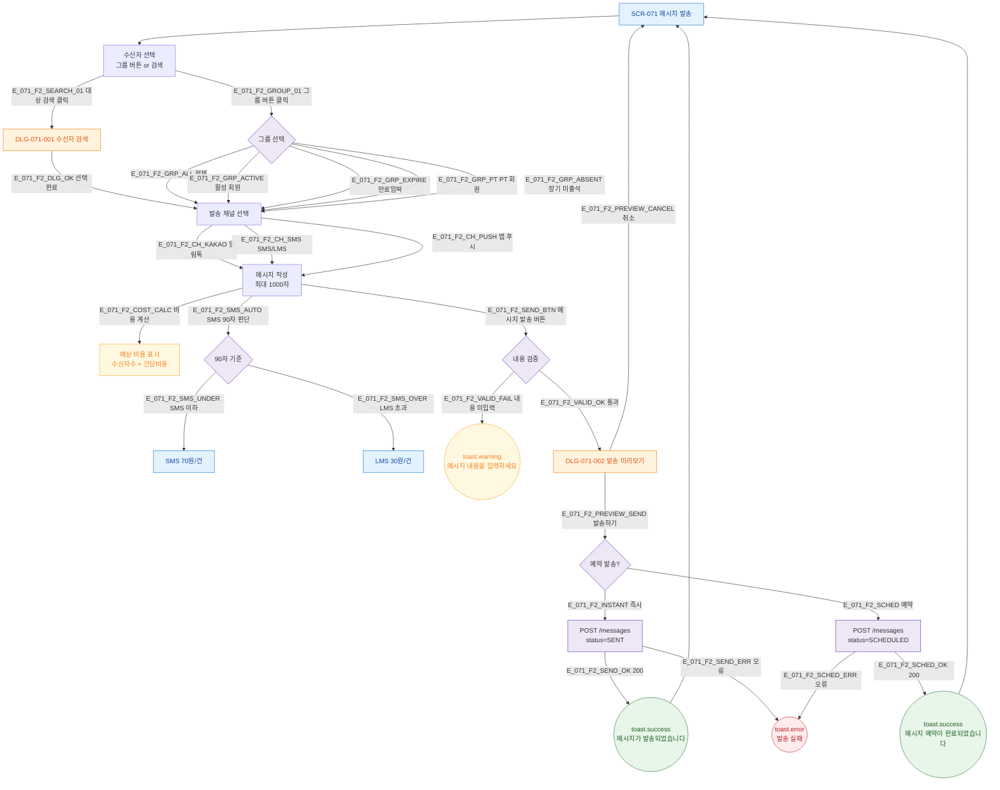

## 1. 목적

메시지 발송 Happy Path — 수신자 선택, 채널 선택, 내용 작성, 미리보기, 발송/예약 흐름을 TC 원천으로 제공한다.

## 2. 전제조건

- SCR-071 렌더링 완료

## 3. 다이어그램

## 4. 엣지 설명

| 엣지 ID | 출발 | 도착 | 조건 |
|---------|------|------|------|
| E_071_F2_CH_KAKAO | SEL_CHAN | WRITE_MSG | 알림톡 선택 |
| E_071_F2_SMS_UNDER | SMS_TYPE | LABEL_SMS | 90자 이하 → SMS 70원 |
| E_071_F2_SMS_OVER | SMS_TYPE | LABEL_LMS | 90자 초과 → LMS 30원 |
| E_071_F2_VALID_FAIL | VALID | T_WARN | 내용 비어있음 |
| E_071_F2_INSTANT | RESERVE_CHECK | API_SEND | 즉시 발송 |
| E_071_F2_SCHED | RESERVE_CHECK | API_SCHED | 예약 발송 |

## 5. TC 후보

| TC ID | 타입 | Given | When | Then |
|-------|------|-------|------|------|
| TC-071-001 | positive P0 | 수신자 3명 + 알림톡 + 내용 | 발송 | toast.success("메시지가 발송되었습니다.") |
| TC-071-002 | positive P1 | 채널=sms + 80자 | 내용 입력 | SMS 라벨 + 70원/건 |
| TC-071-003 | positive P1 | 채널=sms + 100자 | 내용 입력 | LMS 라벨 + 30원/건 |
| TC-071-006 | negative P0 | 내용 비움 | 발송 버튼 | toast.warning("메시지 내용을 입력하세요.") |
| TC-071-009 | positive P1 | 예약 체크 + 날짜/시간 | 발송 | status=SCHEDULED + 예약 완료 toast |
| TC-071-014 | edge P2 | 발송 중 | 다시 클릭 | 두 번째 클릭 무시 |
