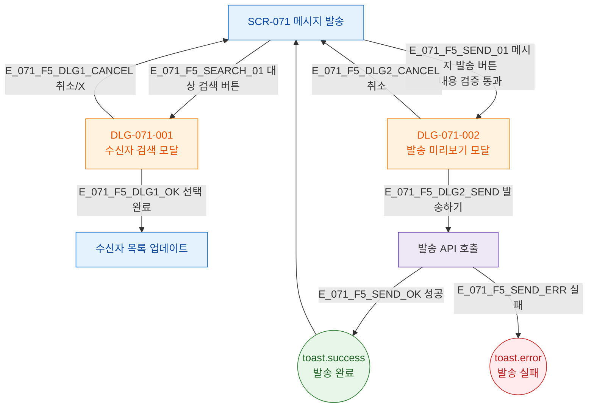

## 1. 목적

SCR-071에서 발생하는 모달 트리거 경로를 트리 형태로 표현한다.

## 2. 전제조건

- SCR-071 렌더링 완료

## 3. 다이어그램

## 4. 엣지 설명

| 엣지 ID | 트리거 | 모달 |
|---------|--------|------|
| E_071_F5_SEARCH_01 | 대상 검색 버튼 | DLG-071-001 |
| E_071_F5_SEND_01 | 발송 버튼(검증 통과) | DLG-071-002 |
| E_071_F5_DLG2_SEND | 발송하기 | 발송 API |
| E_071_F5_DLG2_CANCEL | 취소 | 모달 닫힘 |

## 5. TC 후보

| TC ID | 타입 | Given | When | Then |
|-------|------|-------|------|------|
| TC-071-008 | positive P1 | SCR-071 | 대상 검색 클릭 | DLG-071-001 열림 |
| TC-071-001 | positive P0 | 수신자+채널+내용 완료 | 발송 버튼 | DLG-071-002 → 발송 성공 toast |
