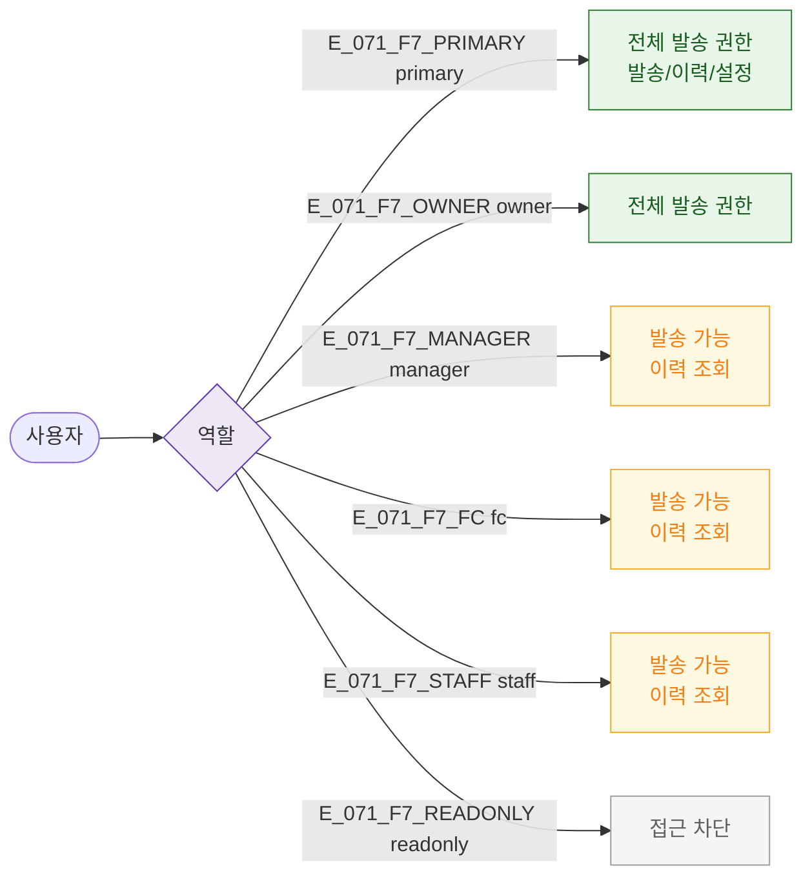

## 1. 목적

6개 역할별 SCR-071 접근 및 발송 액션 가능 범위를 RBAC TC 원천으로 제공한다.

## 2. 전제조건

- 로그인 완료

## 3. 다이어그램

## 5. TC 후보

| TC ID | 타입 | Given | When | Then |
|-------|------|-------|------|------|
| TC-071-F7-01 | positive P0 | staff 로그인 | /message 진입 | 발송 폼 접근 가능 |
| TC-071-F7-02 | negative P0 | readonly 로그인 | /message 진입 | 접근 차단 |
