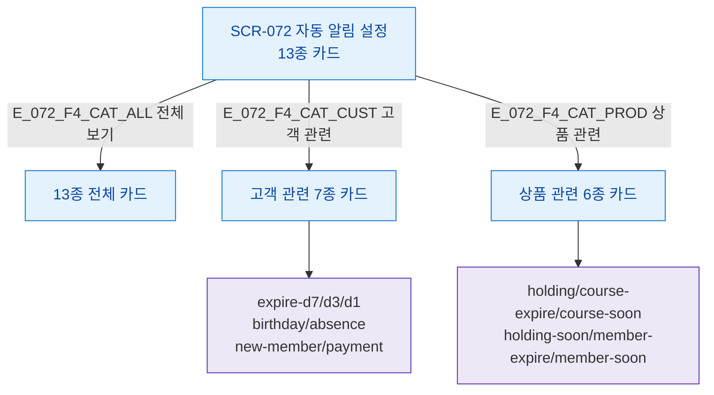

## 1. 목적

SCR-072의 카테고리 필터(고객 관련/상품 관련) 흐름을 TC 원천으로 제공한다.

## 3. 다이어그램

## 5. TC 후보

| TC ID | 타입 | Given | When | Then |
|-------|------|-------|------|------|
| TC-072-F4-01 | positive P2 | SCR-072 | 고객 관련 탭 | 고객 관련 7종 카드만 표시 |
