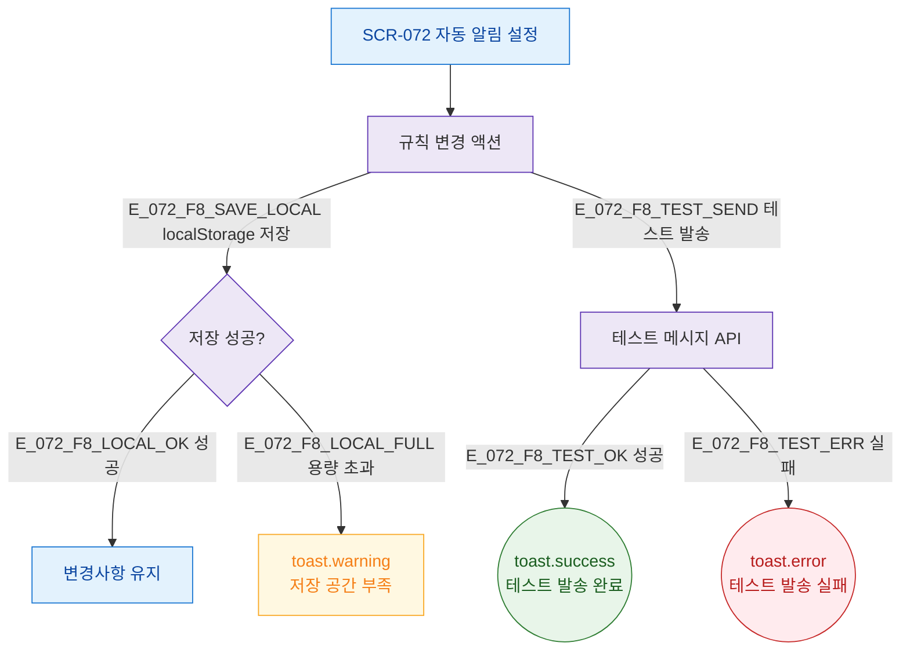

## 3. 다이어그램

```mermaid
flowchart TD
  SCR_072[SCR-072 자동 알림 설정] --> ACT[규칙 변경 액션]

  ACT -->|E_072_F8_SAVE_LOCAL localStorage 저장| LOCAL{저장 성공?}
  LOCAL -->|E_072_F8_LOCAL_OK 성공| SAVED[변경사항 유지]
  LOCAL -->|E_072_F8_LOCAL_FULL 용량 초과| ERR_QUOTA[toast.warning\n저장 공간 부족]

  ACT -->|E_072_F8_TEST_SEND 테스트 발송| TEST_API[테스트 메시지 API]
  TEST_API -->|E_072_F8_TEST_OK 성공| T_OK((toast.success\n테스트 발송 완료))
  TEST_API -->|E_072_F8_TEST_ERR 실패| T_ERR((toast.error\n테스트 발송 실패))

  classDef screen      fill:#E3F2FD,stroke:#1976D2,color:#0D47A1
  classDef success     fill:#E8F5E9,stroke:#2E7D32,color:#1B5E20
  classDef error       fill:#FFEBEE,stroke:#C62828,color:#B71C1C
  classDef warning     fill:#FFF8E1,stroke:#F9A825,color:#F57F17
  classDef system      fill:#EDE7F6,stroke:#5E35B2

  class SCR_072,SAVED screen
  class T_OK success
  class T_ERR error
  class ERR_QUOTA warning
  class ACT,LOCAL,TEST_API system
```

## 5. TC 후보

| TC ID | 타입 | Given | When | Then |
|-------|------|-------|------|------|
| TC-072-F8-01 | exception P2 | localStorage 가득참 | 규칙 저장 | toast.warning(저장 공간 부족) |
