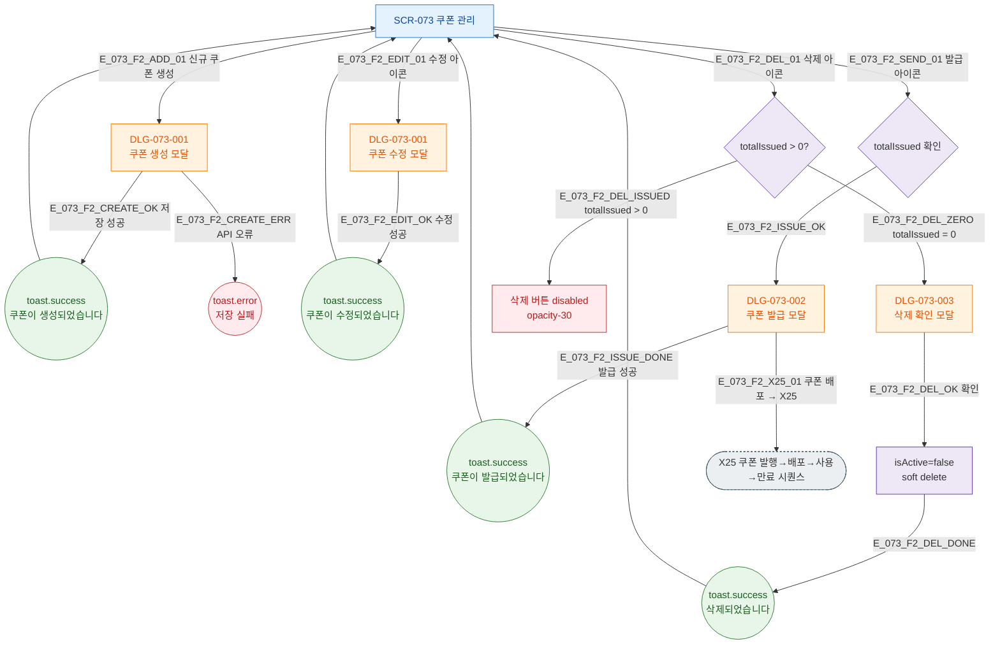

## 1. 목적

쿠폰 생성/수정/발급/삭제 Happy Path와 X25 쿠폰 파이프라인 연결을 TC 원천으로 제공한다.

## 2. 전제조건

- SCR-073 렌더링 완료

## 3. 다이어그램

## 5. TC 후보

| TC ID | 타입 | Given | When | Then |
|-------|------|-------|------|------|
| TC-073-001 | positive P0 | + 신규 쿠폰 → 이름+유형 | 저장 | DB insert + 목록 갱신 |
| TC-073-004 | positive P1 | Send 아이콘 → 회원 선택 | 발급 | toast.success("N 쿠폰이 발급되었습니다.") |
| TC-073-005 | negative P1 | totalIssued > 0 쿠폰 | 삭제 아이콘 | 삭제 버튼 disabled |
| TC-073-006 | positive P1 | totalIssued = 0 쿠폰 | 삭제 확인 | isActive=false soft delete |
