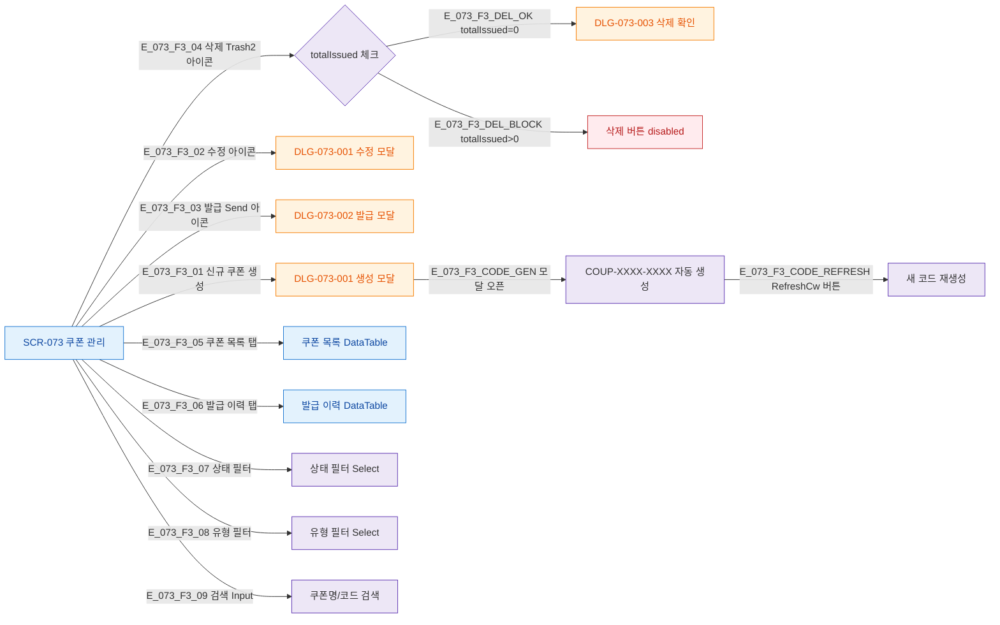

## 3. 다이어그램

## 5. TC 후보

| TC ID | 타입 | Given | When | Then |
|-------|------|-------|------|------|
| TC-073-002 | positive P1 | 생성 모달 오픈 | 자동 생성 | COUP-XXXX-XXXX 패턴 코드 생성 |
| TC-073-003 | positive P2 | RefreshCw 버튼 | 클릭 | 새로운 코드 생성 |
