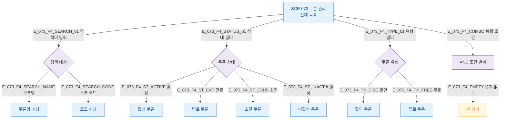

## 3. 다이어그램

## 5. TC 후보

| TC ID | 타입 | Given | When | Then |
|-------|------|-------|------|------|
| TC-073-F4-01 | positive P1 | 쿠폰 존재 | 상태=활성 필터 | 활성 쿠폰만 표시 |
| TC-073-F4-02 | positive P1 | 쿠폰 존재 | 코드 검색 | 코드 매칭 쿠폰만 표시 |
