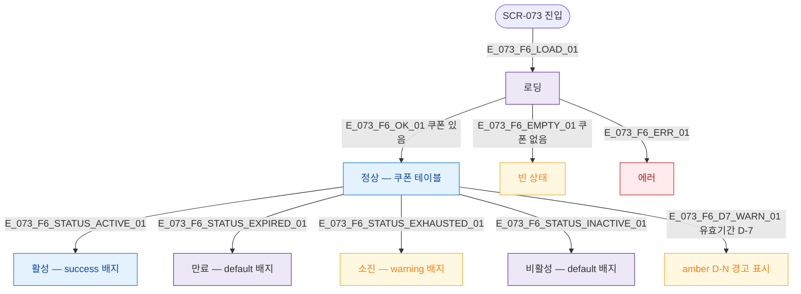

## 3. 다이어그램

## 5. TC 후보

| TC ID | 타입 | Given | When | Then |
|-------|------|-------|------|------|
| TC-073-F6-01 | positive | 진입 | 로드 완료 | 쿠폰 테이블 표시 |
| TC-073-F6-02 | positive | validUntil 경과 쿠폰 | 확인 | 만료 배지 표시 |
| TC-073-F6-03 | positive | totalUsed>=totalIssued | 확인 | 소진 배지 표시 |
| TC-073-F6-04 | positive | D-7 이내 만료 쿠폰 | 확인 | amber D-N 경고 표시 |
