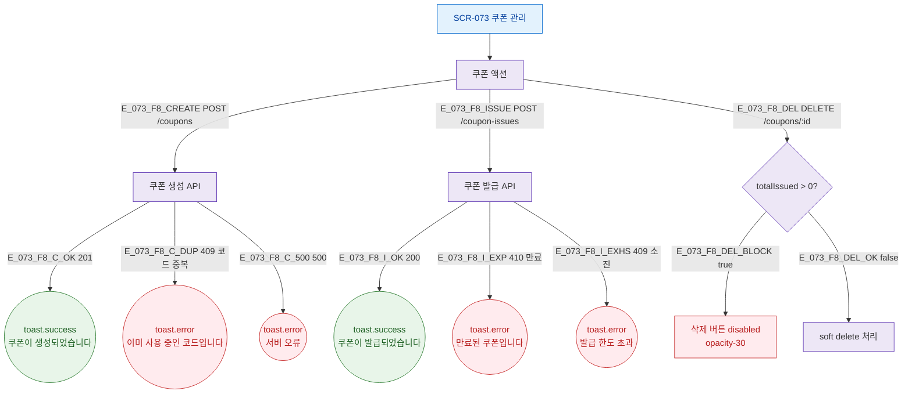

## 3. 다이어그램

## 5. TC 후보

| TC ID | 타입 | Given | When | Then |
|-------|------|-------|------|------|
| TC-073-005 | negative P1 | totalIssued>0 | 삭제 시도 | 버튼 disabled |
| TC-073-F8-01 | negative P1 | 만료 쿠폰 | 발급 시도 | toast.error("만료된 쿠폰입니다.") |
