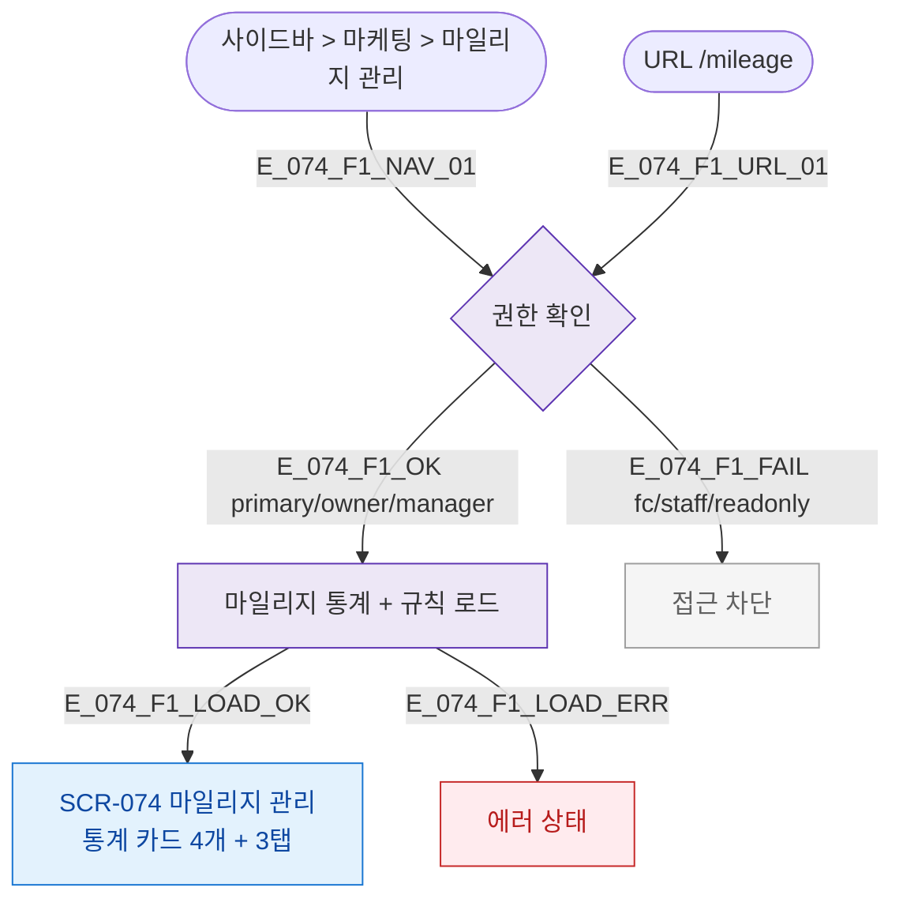

## 3. 다이어그램

## 5. TC 후보

| TC ID | 타입 | Given | When | Then |
|-------|------|-------|------|------|
| TC-074-F1-01 | positive P0 | manager | /mileage 진입 | 통계 카드 + 3탭 렌더 |
| TC-074-F1-02 | negative P0 | fc | 진입 | 접근 차단 |
