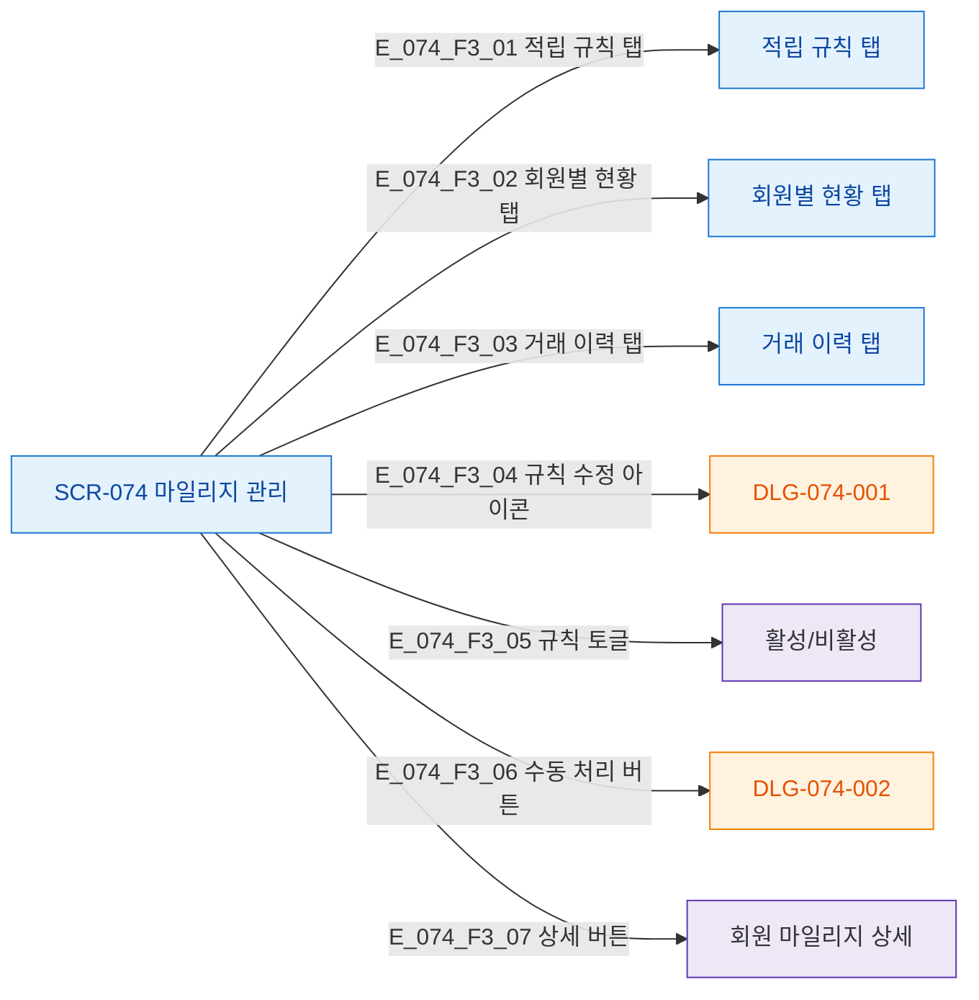

## 3. 다이어그램

```mermaid
flowchart LR
  SCR_074[SCR-074 마일리지 관리]

  SCR_074 -->|E_074_F3_01 적립 규칙 탭| TAB_RULE[적립 규칙 탭]
  SCR_074 -->|E_074_F3_02 회원별 현황 탭| TAB_MEMBER[회원별 현황 탭]
  SCR_074 -->|E_074_F3_03 거래 이력 탭| TAB_HIST[거래 이력 탭]
  SCR_074 -->|E_074_F3_04 규칙 수정 아이콘| BTN_EDIT_RULE[DLG-074-001]
  SCR_074 -->|E_074_F3_05 규칙 토글| BTN_TOGGLE[활성/비활성]
  SCR_074 -->|E_074_F3_06 수동 처리 버튼| BTN_MANUAL[DLG-074-002]
  SCR_074 -->|E_074_F3_07 상세 버튼| BTN_DETAIL[회원 마일리지 상세]

  classDef screen      fill:#E3F2FD,stroke:#1976D2,color:#0D47A1
  classDef modal       fill:#FFF3E0,stroke:#F57C00,color:#E65100
  classDef system      fill:#EDE7F6,stroke:#5E35B2

  class SCR_074,TAB_RULE,TAB_MEMBER,TAB_HIST screen
  class BTN_EDIT_RULE,BTN_MANUAL modal
  class BTN_TOGGLE,BTN_DETAIL system
```

## 5. TC 후보

| TC ID | 타입 | Given | When | Then |
|-------|------|-------|------|------|
| TC-074-F3-01 | positive P0 | SCR-074 | 적립 규칙 탭 클릭 | 규칙 테이블 렌더 |
