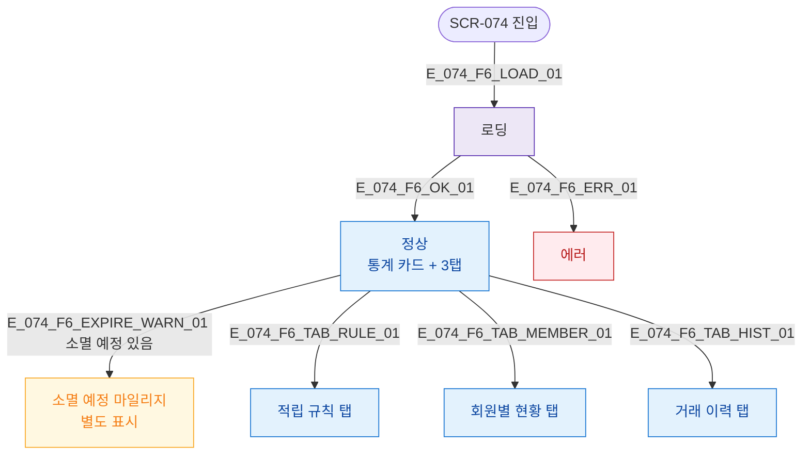

## 3. 다이어그램

## 5. TC 후보

| TC ID | 타입 | Given | When | Then |
|-------|------|-------|------|------|
| TC-074-F6-01 | positive | 진입 | 로드 완료 | 통계 카드 + 3탭 렌더링 |
| TC-074-F6-02 | positive | 소멸 예정 마일리지 있음 | 확인 | 소멸 예정 별도 표시 |
