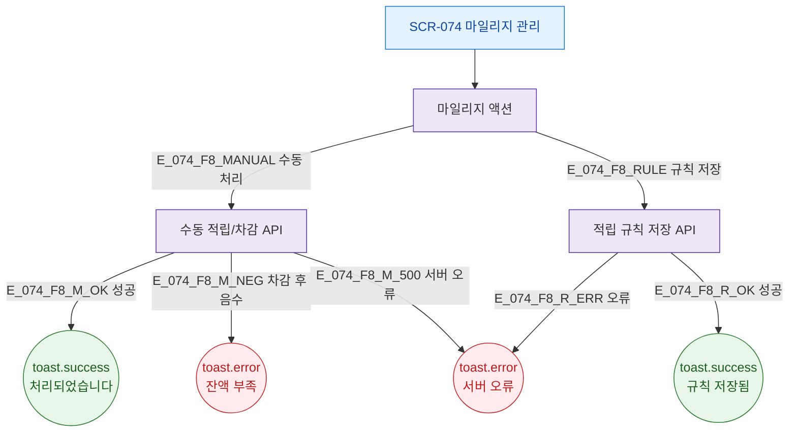

## 3. 다이어그램

```mermaid
flowchart TD
  SCR_074[SCR-074 마일리지 관리] --> ACT[마일리지 액션]

  ACT -->|E_074_F8_MANUAL 수동 처리| MANUAL_API[수동 적립/차감 API]
  MANUAL_API -->|E_074_F8_M_OK 성공| T_OK((toast.success\n처리되었습니다))
  MANUAL_API -->|E_074_F8_M_NEG 차감 후 음수| T_ERR((toast.error\n잔액 부족))
  MANUAL_API -->|E_074_F8_M_500 서버 오류| T_SERVER((toast.error\n서버 오류))

  ACT -->|E_074_F8_RULE 규칙 저장| RULE_API[적립 규칙 저장 API]
  RULE_API -->|E_074_F8_R_OK 성공| T_RULE((toast.success\n규칙 저장됨))
  RULE_API -->|E_074_F8_R_ERR 오류| T_SERVER

  classDef screen      fill:#E3F2FD,stroke:#1976D2,color:#0D47A1
  classDef success     fill:#E8F5E9,stroke:#2E7D32,color:#1B5E20
  classDef error       fill:#FFEBEE,stroke:#C62828,color:#B71C1C
  classDef system      fill:#EDE7F6,stroke:#5E35B2

  class SCR_074 screen
  class T_OK,T_RULE success
  class T_ERR,T_SERVER error
  class MANUAL_API,RULE_API,ACT system
```

## 5. TC 후보

| TC ID | 타입 | Given | When | Then |
|-------|------|-------|------|------|
| TC-074-F8-01 | negative P1 | 잔액 부족 | 차감 시도 | toast.error("잔액 부족") |
