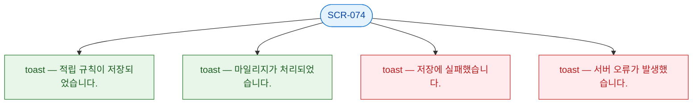

## 3. 다이어그램

## 4. 토스트 목록

| 트리거 | 유형 | 메시지 | |--------|------|--------| | 적립 규칙 저장 성공 | success | 적립 규칙이 저장되었습니다. | | 수동 처리 성공 | success | 마일리지가 처리되었습니다. | | 저장 실패 | error | 저장에 실패했습니다. | | 서버 오류 | error | 서버 오류가 발생했습니다. |
