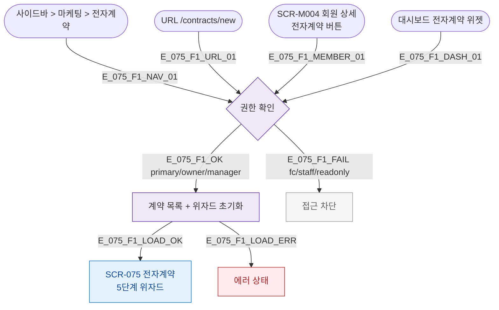

## 1. 목적

SCR-075 전자계약 위자드 진입 경로와 권한 분기를 TC 원천으로 제공한다. X13 시퀀스(전자계약 발송→서명→이용권 자동 개시)와 연결된다.

## 2. 전제조건

- 로그인 상태

## 3. 다이어그램

## 5. TC 후보

| TC ID | 타입 | Given | When | Then |
|-------|------|-------|------|------|
| TC-075-F1-01 | positive P0 | manager | /contracts/new 진입 | 5단계 위자드 Step1 렌더 |
| TC-075-F1-02 | negative P0 | fc | 진입 | 접근 차단 |
