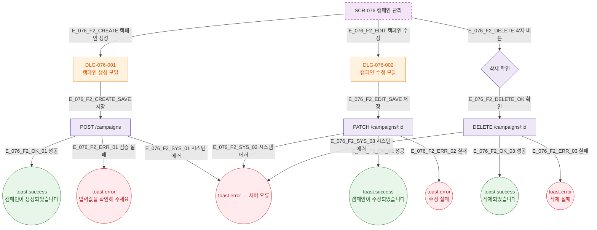

## 1. 목적

캠페인 생성/수정/삭제 Happy Path를 TC 원천으로 제공한다.

## 2. 전제조건

- SCR-076 렌더링 완료

## 3. 다이어그램

## 5. TC 후보

| TC ID | 타입 | Given | When | Then |
|-------|------|-------|------|------|
| TC-076-001 | positive P0 | DLG-076-001 | 저장 | toast.success 캠페인 생성 |
| TC-076-002 | positive P1 | DLG-076-002 | 저장 | toast.success 캠페인 수정 |
| TC-076-003 | positive P1 | 목록 | 삭제 확인 | toast.success 삭제 |
