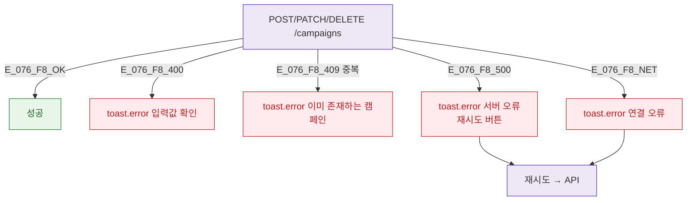

## 3. 다이어그램

## 5. TC 후보

| TC ID | 타입 | Given | When | Then |
|-------|------|-------|------|------|
| TC-076-F8-01 | negative P1 | 생성 | 중복 이름 409 | toast.error 중복 캠페인 |
| TC-076-F8-02 | negative P2 | 생성 | 서버 500 | toast.error + 재시도 |
