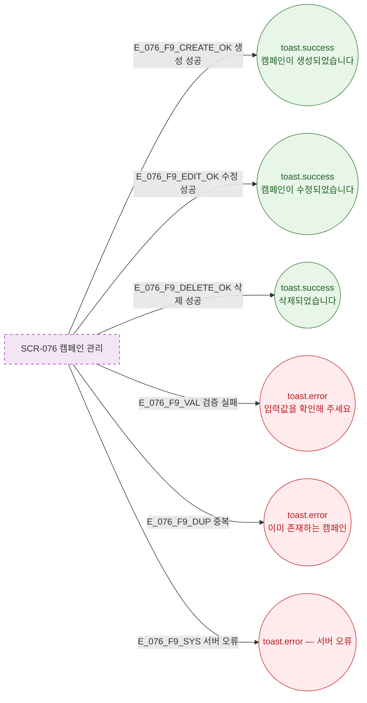

## 3. 다이어그램

## 5. TC 후보

| TC ID | 타입 | Given | When | Then |
|-------|------|-------|------|------|
| TC-076-001 | positive P0 | 생성 | 성공 | toast.success("캠페인이 생성되었습니다") |
| TC-076-002 | positive P1 | 수정 | 성공 | toast.success("캠페인이 수정되었습니다") |
| TC-076-003 | positive P1 | 삭제 | 성공 | toast.success("삭제되었습니다") |
