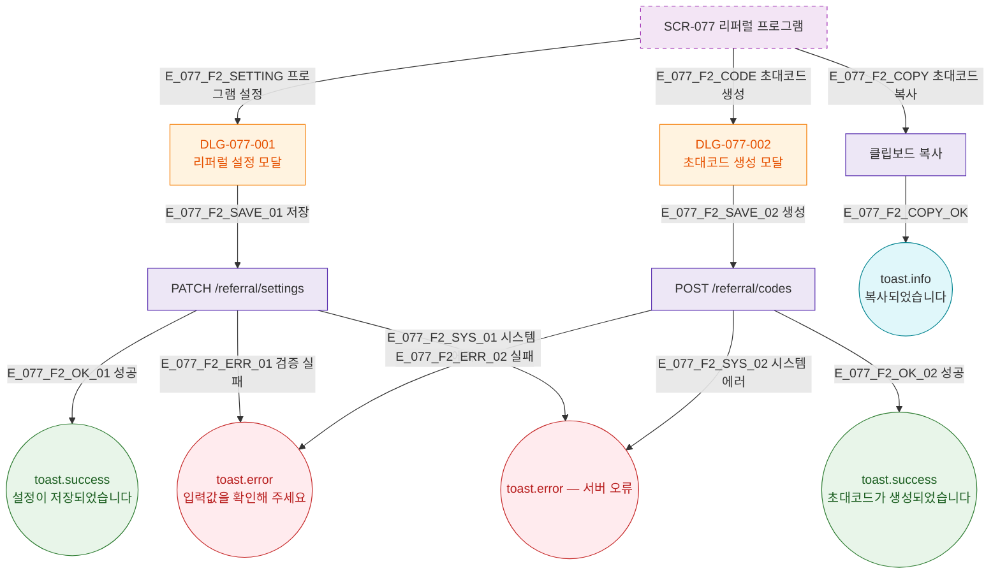

## 1. 목적

리퍼럴 프로그램 설정/초대코드 생성/현황 확인 Happy Path를 TC 원천으로 제공한다.

## 2. 전제조건

- SCR-077 렌더링 완료

## 3. 다이어그램

## 5. TC 후보

| TC ID | 타입 | Given | When | Then |
|-------|------|-------|------|------|
| TC-077-001 | positive P0 | DLG-077-001 | 설정 저장 | toast.success 설정 저장 |
| TC-077-002 | positive P0 | DLG-077-002 | 초대코드 생성 | toast.success 코드 생성 |
| TC-077-003 | positive P1 | 초대코드 | 복사 버튼 | toast.info 복사됨 |
